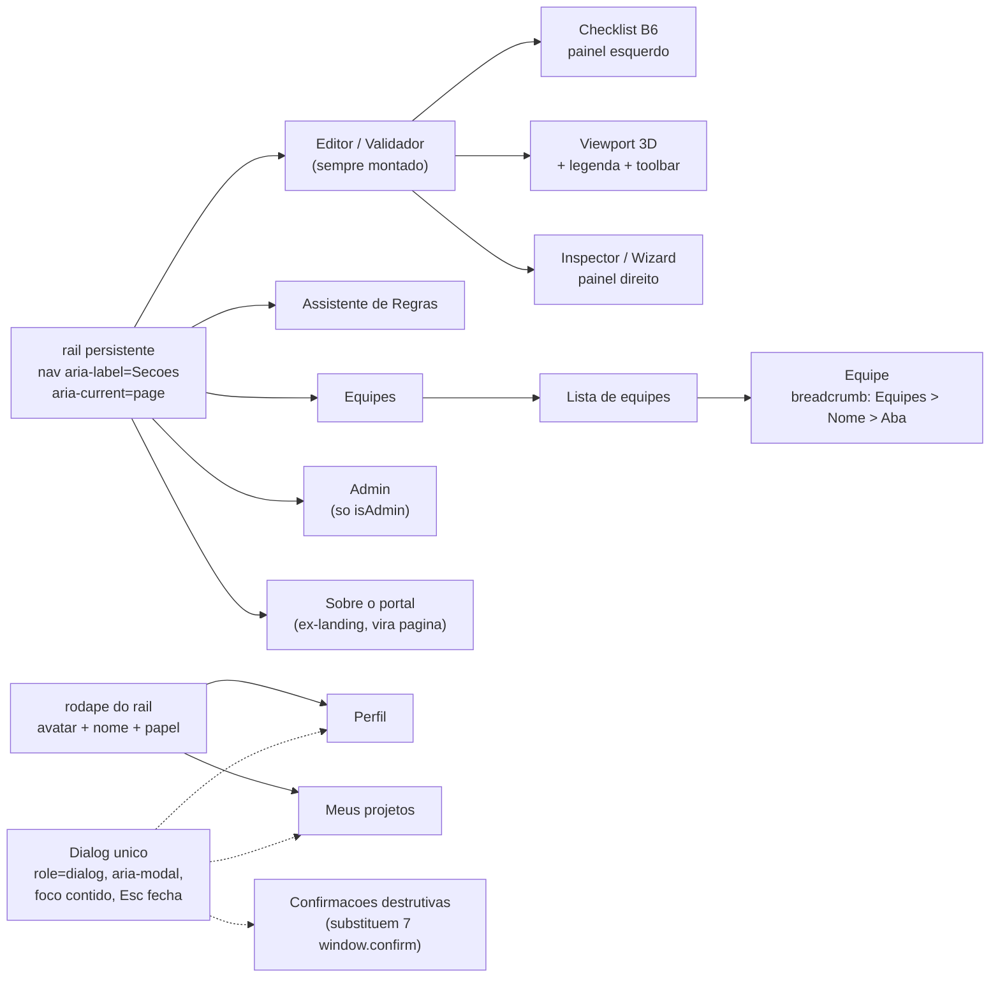

# Estudo de design — Bajeiros · linguagem visual do portal

**Data:** 2026-08-26 · **Tipo:** estudo de pesquisa e argumento (o _porquê_)
**Documentos irmãos:** [`docs/design-system.md`](design-system.md) (a especificação normativa de tokens e componentes), [`docs/plano-implementacao-design.md`](plano-implementacao-design.md) (as 13 fases de migração) e [`docs/adr/009-design-system.md`](adr/009-design-system.md) (a decisão registrada)
**Escopo medido:** `apps/web/src/styles.css` (1937 linhas), 14 componentes TSX (5109 linhas), 4 auditorias (CSS, UX, 3D, docs) e 3 críticas adversariais (acessibilidade, viabilidade, marca).

Este documento **não é a especificação**. Ele registra o que foi medido, o que foi decidido e — principalmente — o que **não** foi resolvido. A especificação de tokens e o de-para de hexes vivem em `docs/design-system.md`; o plano de PRs, em `docs/plano-implementacao-design.md`. Aqui está o argumento que os sustenta e as objeções que sobreviveram a ele.

---

## 1. Objetivo e escopo

### 1.1 O que muda

| #   | Mudança                                                                  | Motivo em uma linha                                                                                |
| --- | ------------------------------------------------------------------------ | -------------------------------------------------------------------------------------------------- |
| 1   | Fonte única de verdade de cor: módulo TS + custom properties CSS         | 288 ocorrências de hex, 66 hexes únicos no CSS, 34 hexes inline em TSX, **zero** custom properties |
| 2   | Rampa de superfícies neutra quente substituindo a rampa azul-acinzentada | 6 hexes carregam 2–3 papéis distintos; não existe hierarquia declarada                             |
| 3   | Vocabulário de status consolidado: 1 hex por conceito por modo           | 3 vermelhos para _falha_, 7 âmbares para _marca/atenção_, 2 teais para _removível_                 |
| 4   | Separação explícita entre marca e aviso                                  | marca `#f3a712` × atenção `#e6a817` = **1,04:1** — a mesma cor                                     |
| 5   | Paleta 3D reprojetada com gate de dicromacia                             | 6 pares com ΔE00 < 8, dois deles em 2,3 e 3,1 (efetivamente a mesma cor)                           |
| 6   | Anel de foco global e alcançabilidade por teclado do checklist B6        | 2 regras `:focus-visible` no arquivo inteiro, escopadas a 2 páginas; checklist é `<li onClick>`    |
| 7   | Escala de espaçamento, raio e tipografia                                 | 21 valores de espaçamento, 10 raios, 14 tamanhos de fonte (84 de 94 declarações entre 10 e 13px)   |
| 8   | Camadas translúcidas do 3D ganham wireframe opaco e grade legível        | gabarito 1,91:1, manequins 2,23/2,12:1, zona do punho 1,45:1, grade 1,35:1                         |

### 1.2 O que explicitamente NÃO muda

- **A arquitetura de navegação sem router.** `page` continua no store zustand; o editor continua montado com `display: none` quando outra página está ativa. Verificado em `node_modules/@react-three/fiber` (v8): `createRoot(canvas)` só é reconfigurado quando `containerRect` tem largura e altura > 0 — sob `display: none` o efeito é pulado e cena, câmera e `OrbitControls` sobrevivem. Não há estado de câmera em `apps/web/src/store.ts` para restaurar. **Regra dura: nenhum PR desta linha de trabalho pode alterar a montagem de `.main` ou de `<Viewport>`.**
- **Router e URLs por tela.** Cortado — ver §10.2 e §11.3.
- **Paleta de comandos (Ctrl+K).** Cortada — ver §11.4.
- **O tema claro na primeira entrega.** Os tokens são projetados nos dois modos agora (barato, evita retrabalho na fonte de verdade), mas só o escuro é entregue. Ver §7.6 e §10.5.
- **A stack.** React 18 + r3f 8 + drei 9 permanecem (majors 9/10 exigem React 19). Vite 8.2.2, zustand 5, zod 4, three 0.185.
- **O disclaimer permanente e a restrição de marca.** `specs/spec.md` §1 declara o disclaimer como obrigação de interface e proíbe o uso da identidade "SAE". Um redesenho que "limpa" a topbar pode apagá-los e **nenhum teste detecta isso**.
- **A lógica de regras.** Nada em `packages/core` é tocado. A precedência `fail > warn > classe` é comportamento, não estilo, e permanece.

### 1.3 Não-objetivos

Não é objetivo deste estudo introduzir framework de CSS, biblioteca de componentes, CSS Modules ou BEM. A migração é de valores para tokens dentro da folha plana existente. A justificativa está em §11.1.

---

## 2. Diagnóstico do estado atual

### 2.1 Os números

| Métrica                        | Valor medido                         | Onde                                                   |
| ------------------------------ | ------------------------------------ | ------------------------------------------------------ |
| Linhas de CSS                  | 1937                                 | `apps/web/src/styles.css`                              |
| Custom properties definidas    | **0**                                | —                                                      |
| `var()` no arquivo             | 1, órfã (`var(--mono, …)`, L1315)    | `.assistant-cite`                                      |
| Ocorrências de hex             | 288                                  | 287 linhas distintas                                   |
| Hexes únicos no CSS            | 66                                   | —                                                      |
| Hexes que só existem em TSX    | 14                                   | legenda 2D, canvas, seleção inline                     |
| Total de cores no app          | **80**                               | —                                                      |
| Seletores de classe planos     | ~185                                 | sem BEM, sem CSS Modules                               |
| Regras CSS                     | ~312 (316 blocos c/ 4 `@keyframes`)  | —                                                      |
| Linhas de TSX                  | 5109                                 | 14 componentes                                         |
| Hexes inline em TSX (3D)       | 34                                   | Viewport 15, App 5, Inspector 3, Manikin 2, Geraldao 1 |
| Valores de espaçamento         | 21 (com ímpares 1/3/5/7/9/11)        | ~40 declarações fora de escala                         |
| Valores de border-radius       | 10 (51 declarações)                  | pares indistinguíveis 3/4 e 5/6                        |
| Tamanhos de fonte              | 14 (94 declarações)                  | **84 delas entre 10px e 13px, em 7 degraus**           |
| Regras `:focus-visible`        | 2                                    | `.team-page` L1424, `.org-chart` L1665                 |
| `outline: none` sem substituto | 3                                    | L460, L866, L1541                                      |
| Testes em `apps/web`           | **14** (2 arquivos de store zustand) | nenhum toca `className` ou CSS                         |

Os cinco hexes mais frequentes: `#f3a712` 34× (marca), `#2c3542` 23× (borda), `#262d36` 22× (borda), `#d8dee5` 16× (texto), `#8a95a3` 16× (texto secundário).

### 2.2 O bloqueio central não é a quantidade de cores

É que o mapeamento hex→token **não é 1:1**. Seis hexes de alta frequência carregam dois ou três papéis semânticos distintos:

| Hex       | Papéis simultâneos                                                           | Linhas de evidência                |
| --------- | ---------------------------------------------------------------------------- | ---------------------------------- |
| `#0f1216` | fundo do `body` **e** fundo de campo de formulário **e** fallback da landing | L15, L453, L500, L858, L906, L1532 |
| `#171c22` | superfície de chrome (12×) **e** `th` sticky **e** fundo de botão            | L32…L1823                          |
| `#3a2f10` | fundo de pill ativa **e** fundo de botão primário **e** cor de borda         | L413, L596, L1054, L1457, L1845    |
| `#262d36` | borda (21×) **e** background de avatar                                       | L33…L1892                          |
| `#2c3542` | borda (19×) **e** `scrollbar-color` **e** traço de conector do organograma   | L127…L1731                         |
| `#212a34` | superfície de botão **e** cor de hover                                       | L481, L519, L542, L579, L781       |

Consequência operacional: **um find/replace mecânico funde papéis que precisam poder divergir depois**. Esses seis hexes viram 13–15 tokens, não 6. A migração é por papel, com a tabela na mão, arquivo por arquivo — não por `sed`.

### 2.3 Semântica já quebrada antes de qualquer redesenho

- **Três vermelhos para "falha"**: `#ff8a8e` (7×, `.badge.fail`, `.removal-bad`, `.anchor-bad`, `.modal-err`), `#e5484d` (3× no CSS + `Viewport.tsx:20` + `App.tsx:215`), `#f1a3a6` (1×, `.admin-chip.bad`). Quatro fundos correspondentes divergem também.
- **Sete âmbares** para marca + atenção: `#f3a712`, `#e6a817`, `#fbbf24`, `#d9a441`, `#f3c86a`, `#b08a3e`, `#ffd7ab` — mais seis fundos âmbar escuros.
- **Três superfícies azuis** para "selecionado"/"informativo": `#1e2836`, `#1d3a5f`, `#24384d`, com quatro textos divergentes sobre elas.
- **Três cinzas de texto secundário escolhidos pela família de arquivo, não pelo significado**: `#8a95a3` (editor/landing/org), `#8ea0b5` (admin/assistant/team), `#9aa8b8` (rótulo de botão).
- **Dois teais para uma semântica declarada**: `#2dd4bf` no CSS (`.removal-ok`) e `#22d3ee` no 3D e no `Inspector.tsx:199`, ambos significando "removível sem infração".
- **Três duplicatas de 1 unidade**, quase certamente erro de digitação: `#232b35`/`#232b36`, `#3a2c0c`/`#3a2c0d`, `#1c232b`/`#1c232c`.

### 2.4 Achados de UX, por arquivo:linha

**Navegação e estado**

- Nenhum estado de navegação está na URL. `session.ts:40-44` e `:67-74` declaram `panel`, `page` e `landing` como zustand puro; `store.ts:83` usa `create<State>()` sem `persist`; o único uso de `history` é o `replaceState` que apaga o token de convite (`session.ts:90`). Não há link compartilhável, o botão Voltar não faz nada e o F5 descarta tudo.
- `Landing.tsx:144` promete "seus dados ficam só neste navegador até você salvar na nuvem" — nada é persistido. A promessa é falsa.
- Colar um convite numa aba já aberta abre o modal de login **debaixo** da landing: `session.ts:126-134` define `panel: 'login'` sem tocar em `landing`, e `.landing` tem `z-index: 300` (`styles.css:900`) contra `.modal-overlay` efetivo 50. É o caminho de entrada de todo novo membro de equipe.
- `.modal-overlay` declara `z-index` **duas vezes na mesma regra**: 200 na L787 e 50 na L793. O valor efetivo é 50, não os 200 que a arquitetura documenta. Funciona hoje por acidente, porque `zIndexRange={[40,0]}` do drei mantém os rótulos 3D abaixo de 50.
- Três mecanismos de "voltar" com destinos diferentes para páginas irmãs: `App.tsx:19-29` (assistente → landing), `App.tsx:31-41` (admin/equipes → editor), `AccountMenu.tsx:79-98` (toggles: clicar "Equipes" estando em Equipes volta ao editor). Mais um quarto dentro de Equipes (`TeamPage.tsx:229-231`) e um quinto dentro do modal de Projetos (`SessionPanels.tsx:364`).
- Profundidade máxima em Equipes → Estrutura: até 10 andares de aninhamento visual, sem breadcrumb, com quatro botões "voltar" no caminho (`TeamPage.tsx:91` fixa `MAX_DEPTH = 5`, indentação `depth * 18` inline em `:942` e `:988`).

**Teclado e foco**

- Busca por `Escape`, `keydown` e `onKeyDown` em todo `apps/web/src` retorna **uma** ocorrência: `AssistantPanel.tsx:359` (Enter do textarea). Esc não fecha nada.
- `SessionPanels.tsx:12-19`: o overlay é uma `div` com `onClick`, sem `role="dialog"`, sem `aria-modal`, sem foco inicial, sem contenção nem restauração de foco. O botão de fechar é `✕` (U+2715) em 24×22px — nome acessível "multiplication x".
- `Landing.tsx:67` usa `role="dialog"` numa superfície de página inteira que é a home.
- `RulePanel.tsx:31-35`: o checklist B6 inteiro é `<li onClick>` sem `tabIndex`, sem `role`, sem `onKeyDown` — e com um `<button className="rule-ask">` aninhado dentro (`:47`). Pôr `tabIndex` no `li` cria `nested-interactive`; converter em `<button>` exige reestruturar o componente.
- `tabIndex` aparece zero vez em `apps/web/src`; `role=` aparece uma vez.

**Seleção e canvas**

- `selectMember()` / `selectNode()` não são chamados de nenhum lugar fora do 3D. Não existe lista DOM de membros nem de nós. O `<Canvas>` (`Viewport.tsx:308-320`) não tem `aria-label`, `role`, `tabIndex` nem conteúdo de fallback. **A função central do produto é 100% ponteiro.**
- `Inspector.tsx:442-447`: qualquer clique no 3D salta a sub-aba para "Seleção"; selecionar um ponto de direção salta para "Piloto". O contexto de trabalho é descartado.

**Layout e densidade**

- `.sidebar` fixa em 380px (340px à esquerda) **sem `flex-shrink: 0`**, contra `.viewport-wrap` com `flex: 1; min-width: 0`. A 200% de zoom em 1366×768 o viewport CSS vira 683px, os painéis encolhem para ~341px cada e **o canvas 3D fica com largura 0**. `body { overflow: hidden }` (L17) impede qualquer rolagem de recuperação. A 100% em 1366px já sobram só 606px para o 3D.
- Os únicos `@media` do arquivo de 1937 linhas são dois `prefers-reduced-motion` (L990 e L1933), e nenhum deles cobre as transições de `transform` de `.landing-cta` (L1059/L1066) e `.landing-cta-arrow` (L1103/L1070).

**Erros, feedback e ações destrutivas**

- Sete `window.confirm` nativos (`SessionPanels.tsx:225`, `:339`; `TeamPage.tsx:213`, `:605`, `:619`, `:931`, `:1140`) e um `alert('JSON inválido')` (`Inspector.tsx:498`) — fora do tema, sem hierarquia entre "desistir de um convite" e "excluir sua conta", impossíveis de cobrir por teste.
- `Inspector.tsx:920-922`: "Restaurar template" apaga a gaiola inteira em um clique, sem confirmação e sem desfazer. Não há pilha de undo em `store.ts`.
- `SessionPanels.tsx:30`: o erro de rede mostrado ao estudante é `'Erro de rede — API local rodando? (npm run db:start + npm run dev -w @bajeiros/api)'`. O mesmo texto se repete em `TeamPage.tsx:131-142`, `AdminPanel.tsx:86` e `AssistantPanel.tsx:113`. Nenhum erro do app oferece "tentar de novo".
- `AdminPanel.tsx:147-164`: quando uma listagem paginada falha, `rows` permanece `null` e a tela mostra "Carregando..." para sempre ao lado da mensagem de erro.
- `TeamPage.tsx:661-670` e `:709-720`: papel de acesso e função gravam direto no `onChange` de um `<select>` — navegar com as setas do teclado dispara um PATCH a cada passo.
- Nenhum `aria-live` no `src`. A confirmação de salvamento é um `<span>` de 12px por 4s no canto oposto ao foco (`AccountMenu.tsx:13-16`).

**Rótulos**

- Códigos internos de entrega vazando para a interface do estudante: `(DF-4)` em `Inspector.tsx:74`, `(DF-5)` em `:174`, `(DF-6)` em `:273`, `(DF-2)` em `:858`, `(DF-7)` em `:877`.
- `TeamPage.tsx:82-88`: "Organograma" e "Estrutura" são duas visões da mesma árvore; "Entradas" significa convites + pedidos; "Papel de acesso" e "Função" ficam lado a lado na mesma tabela com a distinção explicada só num comentário de código (`TeamPage.tsx:6-8`).

### 2.5 A rede de proteção é zero, e isso muda o plano

`apps/web` tem 14 casos de teste em 2 arquivos (`continuity-store.test.ts` 9, `steering-store.test.ts` 5), ambos de lógica zustand pura. Não há jsdom, testing-library, playwright, storybook ou snapshot em nenhum workspace. Nenhum teste referencia `className`, `getComputedStyle` ou `styles.css`. O CI (`lint · format:check · typecheck · test · build`) **passa verde num arquivo visualmente destruído**.

Conclusão operacional: propor infraestrutura de regressão visual como pré-requisito mataria a iniciativa (é um projeto inteiro). O que cabe é um vitest (~80 linhas) que importa o módulo TS de tokens e assere a tabela de contrastes — o único guarda automatizado realista, e o que segura margens de **0,004** como `#805c12` sobre `--bj-brand-bg` = 4,504.

---

## 3. Quem usa e em que contexto

| Dimensão      | Fato                                                                            | Consequência de design                                                                                                 |
| ------------- | ------------------------------------------------------------------------------- | ---------------------------------------------------------------------------------------------------------------------- |
| Público       | estudantes de engenharia de equipes Baja SAE no Brasil, **91 equipes mapeadas** | não são designers nem usuários de CAD profissional; a curva de aprendizado precisa ser curta                           |
| Máquina       | notebook pessoal, frequentemente 1366×768                                       | 606px de viewport 3D a 100%; **0px a 200%** — reflow é requisito, não polimento                                        |
| Local         | sala de aula e oficina; **às vezes projetor**                                   | contraste de 1,05:1 entre superfícies adjacentes não existe em projetor; 11px projetado é ilegível da terceira fileira |
| Conexão       | variável                                                                        | webfont é custo real; três famílias são três downloads                                                                 |
| Idioma        | português do Brasil                                                             | vocabulário de status precisa de string canônica em pt-BR                                                              |
| Sessão típica | modelagem longa, ida e volta entre editor e Equipes                             | perder câmera ao navegar é regressão funcional                                                                         |
| Cor           | população estudantil ampla ⇒ ~8% dos homens com dicromacia                      | status **nunca** pode depender só de cor, no 2D e no 3D                                                                |

Duas consequências merecem ser escritas como restrição, porque contradizem o instinto:

1. **O projetor derruba croma antes de derrubar luminância.** Estados comunicados por diferença de matiz sobre luminância igual (o caso de `.toggle.active`, 1,05:1 entre `--bj-bg-raised` e `--bj-accent-bg`) somem primeiro. Estado ativo precisa de pista não-cromática.
2. **O notebook em oficina iluminada é o argumento honesto do tema claro** — e não o gabarito do Geraldão, como se argumentou inicialmente. Ver §7.6.

---

## 4. Referência 1 — Claude Console: o que é transponível e o que não é

Valores extraídos ao vivo do DOM de `platform.claude.com` (tema escuro) em 2026-08-26. Não é memória.

### 4.1 O que foi medido

| Aspecto                 | Valor observado                                                                                                                                          |
| ----------------------- | -------------------------------------------------------------------------------------------------------------------------------------------------------- |
| Fundo / texto do `body` | `#151515` / `#f0efec`                                                                                                                                    |
| Corpo                   | `anthropicSans` → `system-ui`, "Segoe UI", Roboto, Helvetica, Arial                                                                                      |
| Títulos h1/h2           | `anthropicSerif` (**serifada**), 22px, peso 500, tracking normal                                                                                         |
| Raio                    | `--cds-radius` = **8px**, dominante e único                                                                                                              |
| Bordas                  | alfa-branco, não hex: 10% / 20% / 40%                                                                                                                    |
| Rampa de fundo          | `--bg-000` `hsl(60 1.59% 12.35%)` (levemente **quente**) até `--bg-400/500` 4,31% = `#0b0b0b`                                                            |
| Marca                   | `--brand-100` = clay `#d97757`; acento azul `#2a78d6`/`#61a0f5`                                                                                          |
| Status                  | fundo tinto **muito** escuro + borda tinta média + fg claro (accent bg `#032042` / borda `#0d366b`; danger bg `#3c0e0e` / borda `#641919`)               |
| Foco                    | anel **duplo**: `inset 0 0 0 1px #151515, 0 0 0 1px #2a78d6`                                                                                             |
| Legendas                | 11 / 12 / 13px; ícones 16px e 24px                                                                                                                       |
| Sombra                  | `0 1px 2px 0 …6%, 0 2px 8px 0 #000` — elevação **muito** sutil                                                                                           |
| Chips de estado         | `color-mix(in srgb, COR 20%, transparent)` fundo, 40% borda                                                                                              |
| Layout                  | rail esquerdo ~255px, busca no topo (Ctrl K), lista **plana** sem ícones, item ativo = retângulo de fundo sutil raio 8, rodapé com avatar + nome + papel |

### 4.2 Transponível

- **A rampa de fundo levemente quente.** O Console não usa cinza puro: `--bg-000` tem matiz 60° a 1,59% de saturação. É exatamente o mecanismo que permite uma rampa "de ferro empoeirado" sem virar campo cromático.
- **Bordas como alfa sobre branco.** Uma borda alfa compõe corretamente sobre qualquer superfície da rampa, o que elimina a família de sete cinzas de borda do estado atual. Com uma ressalva de implementação séria em §7.7.
- **O padrão de chip de status** (fundo tinto escuro + borda tinta + fg claro). É o que permite marca e aviso coexistirem a 12,6° de matiz sem colidir, porque a marca vive na polaridade oposta (superfície chapada + tinta escura).
- **Raio único dominante.** 8px como padrão, com 4px para elementos pequenos e 12px para superfícies grandes — contra os 10 raios atuais.
- **Display serifado + corpo sans.** É a assinatura tipográfica do Console e é barata em superfície: 22px peso 500.
- **Elevação por sombra quase imperceptível.** Coerente com um app denso.
- **O rail de navegação com item ativo como retângulo preenchido.** Resolve descoberta, estado ativo e "onde estou" de uma vez, contra os três mecanismos concorrentes de "voltar" do estado atual.

### 4.3 Não transponível — e por quê

**Um console de API não é um editor CAD 3D denso.** As diferenças estruturais:

1. **Densidade e simultaneidade.** O dashboard do Console mostra grids de cards de 3 e 4 colunas, com muito respiro. O editor mostra checklist B6 + viewport WebGL + Inspector de 927 linhas com 6 sub-abas — três colunas competindo por 1366px. Espaçamento de card do Console aplicado ao Inspector estoura a coluna.
2. **O viewport é um consumidor de cor, não um contêiner de componentes.** O Console não tem WebGL. Nenhuma decisão de layout ou de elevação dele fala sobre materiais `three.js`, iluminação `ambient 0.6 + directional 1.2`, ou o fato de a mesma cor variar 2,26–2,73:1 entre face iluminada e face em sombra.
3. **Ctrl+K não se paga aqui.** O Console indexa dezenas de destinos e comandos. O portal tem **quatro** páginas alcançáveis em dois cliques no `AccountMenu`. Uma paleta de comandos custa ~250–300 linhas (componente, listener global, focus trap, semântica listbox com `aria-activedescendant`, índice de comandos, pt-BR) num app que ainda não tem **um** handler de `Escape`. Ver §11.4.
4. **`--cds-focus-shadow` é `box-shadow`, e aqui isso quebra.** `box-shadow` é recortado por `overflow: hidden` do ancestral, e `styles.css` tem pelo menos nove: L769, L804, L1128, L1246, L1377, L1392, L1422, L1838, L1869 — dropdown de conta, modal e cards. O anel de foco sumiria exatamente nos itens de borda. `box-shadow` também não é renderizado em `forced-colors`. Ver §7.7.
5. **O rail do Console tem ~255px.** Aqui, 255px saem diretamente do viewport 3D: 606px viram ~350px em 1366×768 com os dois painéis abertos. O rail precisa ser estreito (~56–64px) ou colapsável, e mesmo assim §10.1 registra que ele **agrava** o problema de reflow em vez de resolvê-lo.
6. **A gramática de status do Console assume que os estados são categorias.** Aqui `warn` e `fail` são uma **escala ordenada de severidade**, e `manual` significa "ainda não verificado", não uma quarta categoria paralela.

---

## 5. Referência 2 — Mad Max: a gramática dos pôsteres e a regra dura

### 5.1 A fonte

Três peças da mesma série de pôsteres de veículos de _Mad Max: Fury Road_ por **Misha Petrick & Evgeniy Yudin** (THE GIGAHORSE, THE INTERCEPTOR, Motorats) + uma arte fotográfica de ferrugem. Quantizadas de verdade (canvas 160px, buckets 4-bit) em 2026-08-26.

### 5.2 A gramática visual da série

1. Campo **chapado** ocre/mostarda ocupando ~85% do quadro.
2. Veículo em silhueta metálica azul-acinzentada escura, centralizado.
3. Tipografia display **condensada pesada** em quase-preto, embaixo.
4. Linhas horizontais finas de velocidade em laranja/vermelho.
5. Sombra achatada sob as rodas.

### 5.3 A paleta medida

| Papel no pôster                 | Hexes medidos                                                                                                                                                           | Área                                    |
| ------------------------------- | ----------------------------------------------------------------------------------------------------------------------------------------------------------------------- | --------------------------------------- |
| Ocre dominante                  | `#c89123`, `#ca9123`                                                                                                                                                    | 85,1% / 86,0% / 80,7% nos três pôsteres |
| Azul-aço do veículo             | `#384658`                                                                                                                                                               | silhueta                                |
| Quase-pretos quentes            | `#170b02`, `#28160a`, `#2e240e`, `#35260d`, `#261c15`                                                                                                                   | tipografia e sombra                     |
| Ocres de sombra                 | `#9d711c`, `#8b651a`, `#785818`, `#765617`, `#674a15`, `#584214`, `#463412`                                                                                             | modelagem do campo                      |
| Família ferrugem/sangue (pin 4) | `#481b14` 7,1% · `#381913` 3,6% · `#572517` 3,2% · `#561c14` 2,8% · `#672617` 2,3% · `#47180d` 2,1% · `#773827` 1,8% · `#673729` 1,6% · `#883926` 1,5% · `#492317` 1,4% | —                                       |
| Cinza-oliva de poeira           | `#353b32`                                                                                                                                                               | 2,2%                                    |

### 5.4 A regra dura: o ocre é ACENTO, nunca superfície

Três razões, em ordem de força.

**(a) Aritmética de contraste.** Um campo `#c89123` tem Y = 0,324. Para texto normal a 4,5:1 sobre ele, a tinta precisa de Y ≤ 0,033 (≈ `#241a08`), e entre `#241a08` e o próprio ocre há **um** degrau utilizável. O produto tem cinco níveis de foreground e seis de superfície. Numa rampa neutra de croma 0,013 cabem os onze; num campo ocre cabem três.

**(b) Adjacência com o status.** `--bj-warn` (`#e07a24`) e `--bj-brand` (`#c89123`) estão a **12,6° de matiz**. Sobre superfície neutra isso é uma diferença clara porque o entorno é acromático. Sobre um campo ocre, ambos se tornam variações do fundo, e o chip de atenção deixa de ser figura. **O ocre como superfície canibaliza o próprio ocre como acento.**

**(c) Densidade.** O pôster tem 85% de ocre porque tem um objeto e três linhas de texto. Este produto tem rail, checklist, inspetor, organograma e um canvas WebGL simultâneos. Um campo cromático de alta saturação sob 1937 linhas de CSS produz fadiga cromática em minutos e empurra toda cor funcional para fora do gamut útil.

**A tradução honesta do pôster é hierarquia de croma, não área.** O ocre ocupa < 2% da tela — marca, botão primário, item ativo do rail, capitão do organograma — e é a única coisa saturada e quente naquele contexto. É o mesmo efeito de dominância que ele tem no pôster, obtido por contraste em vez de por área.

### 5.5 Guardrails contra o pastiche

Duas regras entram no contrato porque o risco real não está na paleta, está na argumentação:

- **R-REF-1.** A referência Mad Max é **fonte de matiz e nada mais**. É proibido usá-la como justificativa de decisão; toda decisão cita medição. O precedente ruim já apareceu neste próprio trabalho: `--bj-3d-selected` = `#ffbb54` (âmbar, família da marca) foi justificado com "metal quente sobre chassi escuro é coerente com a intenção Mad Max" — o número (ΔE 13,4 deutan contra warn) sustenta a decisão; a narrativa não sustentaria nada.
- **R-REF-2.** Proibição explícita de ornamento diegético: sem textura, grunge, estêncil, bordas desgastadas, gradientes de ferrugem, cromado ou ícones temáticos. A credibilidade junto a juízes e orientadores se perde por aí, não pela paleta.

---

## 6. Direção de design resultante

**Eixo:** arquitetura de interação do Claude Console + gradação cromática Mad Max. A gramática vem do Console; a cor vem dos pôsteres, com o ocre como acento.

### 6.1 Princípios

**P1 — Um conceito, um token; um token, um papel.** Um hex por conceito **por modo** (o tema claro quebra a versão global disso — ver §7.6). `fail` tem hoje 2 hexes, `warn` tem 3. A legenda ensina uma cor e o painel usa outra.

**P2 — A fonte de verdade é um módulo TS; o CSS é derivado dele.** `three.js` **não lê custom properties**: `<meshStandardMaterial color="var(--bj-3d-member)">` não funciona, porque `THREE.Color` parseia strings de cor CSS, não `var()`. O módulo TS é a fonte; o `:root` é gerado por script no build ou duplicado com um teste de paridade que falha se divergirem. Sem isso a divergência volta — ela já aconteceu duas vezes.

**P3 — Status nunca depende só de cor.** Sempre ícone + texto no 2D, sempre canal geométrico no 3D. Corolário fiscalizável: as strings canônicas em pt-BR vivem no mesmo módulo dos tokens; sem string canônica o contrato não é fiscalizável e cada componente inventa a sua — que é exatamente como surgiram três vermelhos e sete âmbares.

**P4 — Luminância não é canal utilizável no 3D.** O sombreamento da cena (`ambient 0.6` + `directional 1.2`, `metalness 0.4`, `roughness 0.5`) move a **mesma** cor 2,26–2,73:1 entre face iluminada e sombra. Qualquer par separado por menos de ~2,7:1 de luminância é ruído.

**P5 — Identidade e status são ortogonais e ocupam canais separados.** "primário/secundário" e "pass/warn/fail" não podem disputar o mesmo `material.color`. Sem isso, o produto continua incapaz de mostrar "membro secundário em falha" como tal.

**P6 — Estados transitórios são aditivos, nunca destrutivos.** `Viewport.tsx:145-156` é uma cascata de cinco sobrescritas: selecionar um tubo em FALHA o pinta e a falha some da cena. Seleção, destaque de regra e cadeia física viram contorno/halo por cima da cor de status.

**P7 — Nenhuma dimensão física vira canal de codificação.** Este é um validador dimensional: o raio renderizado deve derivar de `cage.primarySection.od` / `secondarySection.od` (dados que o usuário edita em `Inspector.tsx:391`), nunca de uma constante por categoria. Ver §7.5 — este princípio **corrige** uma proposta anterior deste mesmo estudo.

**P8 — Nenhum limite de controle interativo depende de um degrau de superfície ou de `--bj-border`.** `--bj-border` mede 1,36:1 (dark) e 1,27:1 (light): é hairline de divisor. O tier que cumpre o papel de limite é `--bj-border-strong` (36% / 51%, ≥ 3,0 nas seis superfícies dos dois modos).

**P9 — Toda regra de contraste é um teste, não uma intenção.** O script de medição é versionado e vira vitest no CI. É o que transforma margens de 0,004 em invariante e impede que uma edição futura reintroduza uma reprovação silenciosamente — que é como os 47 casos reprovados atuais surgiram.

**P10 — Acessibilidade estrutural precede polimento cromático.** Tornar o checklist B6 alcançável por teclado muda **quem consegue usar a ferramenta**; trocar 288 hexes não muda. A ordem dos PRs reflete isso.

**P11 — Nenhum token usa sintaxe de cor relativa.** Ver §7.7: é uma falha total, silenciosa, e não há nada a ganhar.

**P12 — O escuro é canônico; o claro é modo de alta luminosidade.** Não é uma segunda expressão de marca. Projetar agora, entregar depois.

---

## 7. Estudo de cor

### 7.1 Matiz de superfície: OKLCh h = 68°, C = 0,013 — "ferro empoeirado"

A rampa neutra é gerada a partir de **um único matiz h = 68°**, a mediana dos quase-pretos dos pôsteres (`#170b02`, `#28160a`, `#261c15` caem entre h ≈ 50° e 75° em OKLCh). Croma fixo em **0,013** — dez a quinze vezes menor que o do ocre do pôster (C ≈ 0,11). É isso que separa "superfície quente" de "campo ocre": o mesmo matiz, croma quase zerado.

Progressão de luminância OKLab, passo constante de 0,029:

| L     | token             | hex (dark) | papel                                    |
| ----- | ----------------- | ---------- | ---------------------------------------- |
| 0,172 | `--bj-bg-inset`   | `#140f0a`  | poços: inputs, código, **canvas 3D**     |
| 0,201 | `--bj-bg-sunken`  | `#1a1510`  | moldura do viewport, cabeçalho de tabela |
| 0,230 | `--bj-bg-canvas`  | `#211c16`  | fundo do app (atrás do rail)             |
| 0,259 | `--bj-bg-base`    | `#28231d`  | painel padrão                            |
| 0,288 | `--bj-bg-raised`  | `#2f2a24`  | cards                                    |
| 0,317 | `--bj-bg-overlay` | `#37312b`  | modais, popovers                         |

Polaridade igual à do Console: o fundo do app é mais escuro que os cards. `--bj-bg-inset` é **literalmente o mesmo valor** de `--bj-3d-bg`, o que faz do viewport um poço sem introduzir um sétimo nível.

**Correção honesta ao racional original.** O racional afirmava "passo de 0,029 dá contraste adjacente de ~1,13:1 — degrau perceptível sem borda". Medido nos hexes finais, os passos são **1,05 / 1,07 / 1,09 / 1,10 / 1,11**, e os dois menores são os que mais importam: `inset→sunken` = 1,05:1 é a fronteira canvas 3D ↔ moldura do viewport; `sunken→base` = 1,07:1 é cabeçalho de tabela ↔ corpo. Extremos `inset→overlay` somam 1,48:1. No tema claro, `raised→overlay` = 1,04:1. **Em projetor, 1,05:1 não existe.** Consequência de contrato: **nenhum limite que carrega significado pode depender só do degrau de superfície** — a moldura do viewport usa `--bj-border-strong` (3,25:1), e cabeçalho de tabela usa borda, não só fundo. Isto é P8 aplicado à rampa.

### 7.2 Marca × aviso: separação por três canais, não por matiz

Matizes finais (HSL): **brand 40°** (`#c89123`, o ocre medido, intocado) → **warn 27,4°** (`#e07a24`) → **fail 13,1°** (`#e56e4d`, mesmo matiz da família de ferrugem `#883926` = 11,6°). Distância brand↔warn: 12,6°.

12,6° não é suficiente sozinho. A separação real vem de três canais empilhados:

1. **Polaridade.** A marca aparece como **superfície preenchida com tinta escura** (`--bj-brand` de fundo, `--bj-on-brand` `#1a1206` de texto). O status aparece como **chip escuro tinto com texto claro** (`--bj-warn-bg` `#331e07` + `--bj-warn-border` + fg `#e07a24`, 5,25:1). É o mesmo mecanismo que o Console usa com clay `#d97757` e danger `#641919` a 15° de distância.
2. **Croma vs. luminância.** O ocre da marca é o mais amarelo dos três; warn é laranja franco. Sob o mesmo fundo neutro, brand lê como "metal" e warn como "chama".
3. **Exclusão de domínio.** O ocre da marca está **proibido na cena 3D**. `Viewport.tsx:194` (estado `pending`) migra para `--bj-accent`. O par 1,04:1 marca/atenção deixa de existir porque os dois nunca mais coabitam um pixel de WebGL.

**Contradição encontrada no de-para, e como se resolve.** O de-para manda `#f3c86a` → `--bj-brand-strong` sobre `#4a3a10` → `--bj-brand-bg` em `.org-status` (trainee) — que é literalmente um chip tinto escuro com fg quente claro, **isomorfo a `.badge.warn`**. Medido: brand × warn ΔE00 mínimo **1,0**; brand-bg × warn-bg **0,7**; brand-border × warn-border **2,5**. Sob protanopia/deuteranopia os dois chips são indistinguíveis nos três canais simultaneamente. **Regra de contrato:** a forma-chip (fundo tinto + borda tinta + fg claro) é **exclusiva dos cinco status**. `.org-status` trainee passa a `--bj-info-bg` / `--bj-info` com ícone. E como o de-para mantém `#f3a712` mapeado 1:1 para `--bj-brand` inclusive em usos como texto, borda e `border-left`, a regra "marca = fill" precisa ser escrita como contrato de uso, não presumida.

Aprovado sai do neon: `#4ade80` (h = 142°, S = 88%) morre e vira **`#6fb060`** (h = 109°, S = 32%), verde sálvia. Convive com ocre e ferrugem porque tem croma comparável; fica a 69° da marca e a 96° do fail; e não parece "LED" numa interface de engenharia. `manual` usa o azul-aço do veículo (`#384658` clareado para `#8ba3bc`). `info` é o único status **acromático** (`#b8ada0`, pedra quente) — é a categoria que menos precisa de matiz, e cedê-la libera orçamento.

### 7.3 Contraste medido — 2D

Método: luminância relativa sRGB (WCAG 2.1), razão (L1+0,05)/(L2+0,05). Tokens com alfa foram **compostos** sobre cada superfície antes de medir. Sanidade: `#fff`/`#000` = 21,0000. Legenda **antes → depois**.

**DARK — foregrounds sobre superfícies**

| foreground          | canvas          | base            | raised          | overlay         | sunken          | inset           | exigido            |
| ------------------- | --------------- | --------------- | --------------- | --------------- | --------------- | --------------- | ------------------ |
| `--bj-fg-primary`   | 14,72           | 13,56           | 12,38           | 11,17           | 15,78           | 16,59           | 4,5                |
| `--bj-fg-secondary` | 9,06            | 8,35            | 7,62            | 6,88            | 9,72            | 10,21           | 4,5                |
| `--bj-fg-muted`     | 5,55            | 5,11            | 4,67            | 4,21            | 5,95            | 6,25            | 3,0 (texto grande) |
| `--bj-fg-faint`     | 3,46 → **3,98** | 3,19 → **3,66** | 2,91 → **3,34** | 2,62 → **3,02** | 3,71 → **4,26** | 3,90 → **4,48** | 3,0                |
| `--bj-disabled-fg`  | 3,07            | 2,83            | 2,58            | 2,33            | 3,29            | 3,46            | isento (1.4.3)     |

**LIGHT — foregrounds sobre superfícies**

| foreground          | canvas          | base            | raised          | overlay         | sunken          | inset           | exigido            |
| ------------------- | --------------- | --------------- | --------------- | --------------- | --------------- | --------------- | ------------------ |
| `--bj-fg-primary`   | 13,94           | 15,06           | 15,82           | 16,48           | 12,60           | 11,36           | 4,5                |
| `--bj-fg-secondary` | 7,51            | 8,11            | 8,52            | 8,88            | 6,78            | 6,12            | 4,5                |
| `--bj-fg-muted`     | 4,72            | 5,10            | 5,36            | 5,59            | 4,27            | 3,85            | 3,0 (texto grande) |
| `--bj-fg-faint`     | 3,05 → **3,71** | 3,30 → **4,01** | 3,46 → **4,21** | 3,61 → **4,39** | 2,76 → **3,35** | 2,49 → **3,02** | 3,0                |
| `--bj-disabled-fg`  | 2,64            | 2,85            | 2,99            | 3,12            | 2,38            | 2,15            | isento             |

**`--bj-on-X` sobre `--bj-X`** (exige 4,5)

| par                     | dark                      | light                     |
| ----------------------- | ------------------------- | ------------------------- |
| on-brand / brand        | 6,65                      | 5,49 → **5,60**           |
| on-brand / brand-strong | 8,59                      | 7,51                      |
| on-brand / brand-dim    | 4,25 **FALHA** → **6,20** | 3,06 **FALHA** → **5,13** |
| on-accent / accent      | 8,04                      | 6,48                      |
| on-pass / pass          | 7,18                      | 6,03                      |
| on-fail / fail          | 5,83 → **6,02**           | 6,28                      |
| on-warn / warn          | 6,20                      | 6,28                      |
| on-manual / manual      | 7,16                      | 7,63                      |
| on-info / info          | 8,38                      | 6,98                      |
| fg-inverse / brand      | 6,64                      | 5,37                      |

**Status sobre fundos** (exige 4,5). DARK à esquerda, LIGHT à direita:

| status    | dark: próprio bg / base / raised / canvas                                       | light: próprio bg / base / raised / canvas                                |
| --------- | ------------------------------------------------------------------------------- | ------------------------------------------------------------------------- |
| brand     | 5,63 / 5,58 / 5,10 / 6,06                                                       | 4,42 **FALHA** → **4,50** / 5,47 / 5,74 / 5,06                            |
| accent    | 6,55 / 6,81 / 6,21 / 7,39                                                       | 5,56 / 6,10 / 6,41 / 5,65                                                 |
| pass      | 6,23 / 5,97 / 5,45 / 6,48                                                       | 5,34 / 5,74 / 6,03 / 5,31                                                 |
| fail      | 4,96 → **5,12** / 4,79 → **4,95** / 4,37 **FALHA** → **4,51** / 5,19 → **5,37** | 5,41 / 6,17 / 6,48 / 5,71                                                 |
| warn      | 5,25 / 5,18 / 4,72 / 5,62                                                       | 5,42 / 6,10 / 6,41 / 5,65                                                 |
| manual    | 6,31 / 5,98 / 5,46 / 6,49                                                       | 6,57 / 7,38 / 7,76 / 6,84                                                 |
| info      | 7,24 / 7,06 / 6,45 / 7,67                                                       | 5,86 / 6,77 / 7,11 / 6,27                                                 |
| brand-dim | — / 3,57 **F** → **5,21** / 3,26 **F** → **4,75** / 3,87 → **5,65**             | — / 2,99 **F** → **5,01** / 3,14 **F** → **5,26** / 2,76 **F** → **4,64** |

**Bordas alfa compostas sobre `--bj-bg-base`** (exige 3,0 quando é o único limite do controle)

| token                  | dark                                                                 | light                                                     |
| ---------------------- | -------------------------------------------------------------------- | --------------------------------------------------------- |
| `--bj-border`          | 1,36 — tier decorativo; **contrato: nunca limite único de controle** | 1,27 — idem                                               |
| `--bj-border-strong`   | 20% = 1,92 **FALHA** → 36% = **3,25** (pior: overlay 3,06)           | 24% = 1,64 **FALHA** → 51% = **3,27** (pior: inset 3,02)  |
| `--bj-border-stronger` | 40% = 3,70 → 55% = **5,69**                                          | 45% = 2,76 **FALHA** → 68% = **5,54** (pior: sunken 5,07) |

**Bordas de status** (exige 3,0). Agravante: `--bj-STATUS-bg` contra `--bj-bg-base` rende só 1,01–1,06:1 (dark) e 1,07–1,21:1 (light) — **a borda é a única pista do limite do chip**.

| token         | dark: base → · próprio bg →                   | light: base → · próprio bg →                  |
| ------------- | --------------------------------------------- | --------------------------------------------- |
| brand-border  | 2,05 **F** → **3,29** · 2,07 **F** → **3,32** | 1,91 **F** → **3,68** · 1,57 **F** → **3,03** |
| accent-border | 2,11 **F** → **3,31** · 2,03 **F** → **3,19** | 1,95 **F** → **3,32** · 1,78 **F** → **3,02** |
| pass-border   | 1,62 **F** → **3,29** · 1,69 **F** → **3,43** | 2,01 **F** → **3,25** · 1,87 **F** → **3,02** |
| fail-border   | 1,51 **F** → **3,30** · 1,57 **F** → **3,42** | 2,32 **F** → **3,43** · 2,04 **F** → **3,01** |
| warn-border   | 1,61 **F** → **3,30** · 1,64 **F** → **3,34** | 2,16 **F** → **3,38** · 1,92 **F** → **3,00** |
| manual-border | 1,66 **F** → **3,29** · 1,75 **F** → **3,48** | 2,20 **F** → **3,37** · 1,96 **F** → **3,00** |
| info-border   | 1,50 **F** → **3,31** · 1,54 **F** → **3,40** | 2,09 **F** → **3,48** · 1,81 **F** → **3,01** |

**Estados de interação** (alfa composto sobre `--bj-bg-base`)

| estado             | cor efetiva | fg-primary | fg-secondary | fg-muted |
| ------------------ | ----------- | ---------- | ------------ | -------- |
| dark hover 5,5%    | `#342f29`   | 11,54      | 7,10         | 4,35     |
| dark active 10%    | `#3e3934`   | 9,94       | —            | 3,75     |
| dark selected 14%  | `#3e321e`   | 10,89      | 6,70         | 4,10     |
| light hover 5%     | `#efe7dc`   | 13,65      | —            | 4,62     |
| light active 10%   | `#e5ddd1`   | 12,42      | —            | 4,21     |
| light selected 14% | `#e9ddc8`   | 12,46      | 6,71         | 4,22     |

**Escopo:** 386 razões de contraste 2D. Estado antes: **47 razões reprovadas**. Estado depois: zero reprovadas dentro dos contratos declarados.

### 7.4 Dicromacia no 2D — a medição que faltava

A análise CIEDE2000 original cobria só os 11 tokens do viewport. Rodada sobre os 7 tokens cromáticos do 2D (Viénot 1999 + CIEDE2000; **verificar** contra o harness Brettel antes de congelar), o resultado é desconfortável:

| par                | normal | protan | deutan  |
| ------------------ | ------ | ------ | ------- |
| dark brand × warn  | 13,9   | 5,0    | **0,9** |
| dark pass × fail   | 53,5   | —      | **4,9** |
| light fail × brand | —      | —      | **1,1** |
| light fail × warn  | —      | —      | **1,1** |
| light warn × brand | —      | —      | **1,6** |
| light pass × fail  | —      | —      | **6,6** |
| warn-bg × brand-bg | —      | —      | **0,6** |
| pass-bg × fail-bg  | —      | —      | **2,5** |

Isso **não invalida** a separação por três canais: o chip preenchido continua legível porque polaridade e forma carregam o sinal. Mas fixa uma consequência dura: **onde a cor é o único portador, o 2D já falha hoje e continuaria falhando**. Os casos concretos:

- `.status-dot` — 9×9px, sem texto, sem `title`, e é a **única** sinalização de infração quando o checklist está recolhido (`App.tsx:198`, `styles.css:169-180`). Deve ser substituído por contagem numérica ("3 falhas") no rótulo vertical, com o ponto como reforço.
- `.wizard-dot.done`, `.project-list li.current`, `.anchor-row.active` e as cores de papel do organograma têm o mesmo padrão.
- `.viewport-toolbar .toggle` ativo: `--bj-bg-raised` → `--bj-accent-bg` é **1,05:1** de luminância. Em projetor desbotado e em parte das dicromacias o estado desaparece. Precisa de `aria-pressed` + pista não-cromática (borda `--bj-border-stronger`, peso de fonte, ou ✓ antes do rótulo).
- Se brand e warn realmente nunca coabitam, **escrever isso como lint** (nenhum seletor com `--bj-brand-bg` dentro do mesmo contêiner de `--bj-warn-bg`), porque 0,9 de ΔE não sobrevive a um descuido futuro.

### 7.5 Cores do 3D

**Tokens do viewport**

| token                      | hex       | papel                               |
| -------------------------- | --------- | ----------------------------------- |
| `--bj-3d-bg`               | `#140f0a` | fundo do canvas (= `--bj-bg-inset`) |
| `--bj-3d-grid`             | `#6c5e51` | grade de chão                       |
| `--bj-3d-member`           | `#e2d6c4` | membro primário conforme            |
| `--bj-3d-member-secondary` | `#928780` | membro secundário conforme          |
| `--bj-3d-selected`         | `#ffbb54` | seleção (contorno, aditivo)         |
| `--bj-3d-fail`             | `#e56e4d` | infração                            |
| `--bj-3d-removable`        | `#b2aadb` | removível sem infringir regra       |
| `--bj-3d-anchor-ok`        | `#3186d4` | hardpoints                          |
| `--bj-3d-anchor-bad`       | `#e56e4d` | ancoragem sem suporte               |
| `--bj-3d-node`             | `#6c788b` | nó livre                            |
| `--bj-3d-node-named`       | `#d5effd` | nó nomeado                          |
| `--bj-3d-pilot`            | `#6bb5ab` | manequins                           |
| `--bj-3d-label-fg`         | `#ece7dd` | texto de rótulo                     |
| `--bj-3d-label-bg`         | `#241f19` | placa de rótulo, **opaca**          |

**Orçamento de dois ramos.** Sob deuteranopia/protanopia sobram amarelo-laranja (b+) e azul (b−). O orçamento foi gasto assim:

- **Membros ficam quase acromáticos** e não consomem matiz. Primário vs. secundário deixa de ser só cor. **Correção de P7:** a proposta original usava raio 0,0127 vs 0,0090 como canal — errada. `Viewport.tsx:167` hoje é `cylinderGeometry args={[0.0127, 0.0127, length, 10]}`, e 0,0127 m é Ø25,4 mm, um diâmetro real de tubo, enquanto o modelo carrega `cage.primarySection.od` (default 31,75 mm, `builder.ts:214`) e `secondarySection.od` (25,4 mm), **editáveis pelo usuário**. Um raio ditado por categoria faria o desenho mentir sobre a coisa que ele existe para conferir, e o canal desapareceria em silêncio se uma equipe configurasse os dois ODs iguais. **Decisão: o raio deriva de `section.od / 2 × S`**, o que corrige de quebra o 0,0127 fixo, e a distinção primário/secundário mantém a luminância como redundância mais um canal não-dimensional (rugosidade/metalness, marcador de extremidade).
- **Ramo b+ na cena: dois significados** — warn e fail — e nem esses dependem de cor: **warn é contorno, fail é preenchimento + emissive**. Um tubo em atenção mantém o metal neutro e ganha um anel; um tubo infrator troca o fill. Isso separa identidade de status (P5) e mantém a seleção aditiva (P6). _Pass não existe no 3D_: conformidade é a ausência de status.
- **Ramo b− na cena:** accent para destaque de regra, gabarito e zona do punho; anchor-ok para hardpoints; pilot para os manequins; removable para redundância. Pares dentro do ramo são separados por **escala e forma** — octaedro de 3 cm vs. malha humana de 1,7 m vs. wireframe de gabarito. O precedente já existe no produto (`.org-vacant` = tracejado + fundo + pílula).
- **Seleção:** contorno + destaque, **nunca fill**, e **nunca escala uniforme** — escalar um `cylinderGeometry` escala o comprimento junto, e um tubo 15% mais longo é inaceitável num validador dimensional. Escala só radial, em malha de contorno separada.

**Contraste contra `--bj-3d-bg` `#140f0a`** (piso não-textual 3:1), paleta corrigida:

| token               | razão                     |
| ------------------- | ------------------------- |
| grid                | 2,21 **FALHA** → **3,05** |
| node                | 4,26                      |
| anchor-ok           | 4,98                      |
| member-secondary    | 5,44                      |
| fail / anchor-bad   | 6,05                      |
| pilot               | 8,00                      |
| removable           | 8,77                      |
| selected            | 11,33                     |
| member              | 13,29                     |
| node-named          | 15,96                     |
| label-fg / label-bg | 13,26                     |
| label-fg / bg       | 15,46                     |

**Dicromacia no 3D — método e resultado.** Simulação Brettel-Vienot-Mollon 1997 (dois semiplanos, parâmetros libDaltonLens) em RGB linear → CIE L\*a\*b\* (D65) → CIEDE2000 completo com termo Rt. Sanidade: branco/preto = 21,0000 de contraste e ΔE00 = 100,00. Paleta original: 55 pares × 4 modos = 220 medidas, com **6 falhas** (ΔE < 8):

| par (paleta original)    | MIN     | modo crítico                  |
| ------------------------ | ------- | ----------------------------- |
| fail vs anchor-bad       | **0,0** | todos (mesmo hex, deliberado) |
| removable vs anchor-ok   | **2,3** | protanopia                    |
| member-secondary vs node | **3,1** | protanopia                    |
| removable vs pilot       | **5,1** | deuteranopia                  |
| selected vs node-named   | **5,5** | todos                         |
| member vs node-named     | **6,4** | todos                         |

Diagnóstico: três azuis na mesma faixa de luminância (L\* 63,9 / 64,0 / 64,6) colapsavam sob protan/deutan, e cinco cinzas quentes estavam espremidos numa escada de L\* sem separação suficiente.

A paleta corrigida foi obtida por otimização max-min (60 reinícios × 10.000 iterações de hill-climbing sobre L\*C\*h, caixas de restrição preservando a família Mad Max, restrição dura ≥ 3:1 contra o fundo). Resultado nos 55 pares: **mínimo 12,32; nenhum par abaixo de 8; 51 dos 54 pares reais acima de 14,3**. Os quatro pares mais apertados envolvem `pilot` (12,3–12,7) e são mitigados por forma: pilot é volume translúcido grande contra tubo fino.

**Limite matemático encontrado:** não existe paleta de 10 cores simultaneamente distinguíveis com ΔE ≥ 15 em normal + protan + deutan + tritan. A otimização livre, sem nenhuma restrição de matiz, convergiu para **13,63** e achatou todos os 45 pares nesse teto. O piso foi relaxado para 12 apenas em `pilot`. A alternativa "dusty" (mais dessaturada, mais fiel ao original) foi medida: mínimo global cai de 12,32 para **10,85**. O trade-off croma × segurança está quantificado, não suposto.

**A ressalva que derruba o "PASSA" — e que fica registrada.** O conjunto medido **não é o conjunto renderizado**. `--bj-warn` (`#e07a24`, contorno de membro em atenção) e `--bj-accent` (`#4fb8d8`, gabarito, zona do punho, nó `pending`, destaque de regra) são desenhados na cena e **não estão entre os 11 tokens medidos**. Com os 12+ tokens que realmente aparecem no WebGL, os piores pares são:

| par                | pior modo  | ΔE00 mínimo                   |
| ------------------ | ---------- | ----------------------------- |
| fail × warn        | tritanopia | **2,1** (5,7 em deuteranopia) |
| removable × accent | protanopia | **2,6** (3,2 em deuteranopia) |
| pilot × accent     | tritanopia | **4,3**                       |

**O mínimo global real é 2,1, não 12,32.** E o pior par é infração × atenção, a distinção mais cara do produto. A mitigação parcial existe e é P3/P5 (warn = contorno, fail = fill + emissive são canais geométricos distintos), mas **a frase "mínimo global 12,32 / zero pares abaixo de 8" não pode ser publicada como veredito**. Ver §10.3.

**Contratos de uso registrados (não é um "passa" incondicional):**

1. **Tier de borda.** `--bj-border` permanece em 1,36 / 1,27 de propósito. Se o CSS usar `--bj-border` em `input`, `select` ou `checkbox`, a paleta volta a reprovar — a correção é de código, não de token. Nenhum destes tokens está em uso ainda, então o contrato pode ser estabelecido antes do primeiro consumo.
2. **`--bj-fg-faint` e `--bj-fg-muted`.** `fg-faint` corrigido garante ≥ 3,0 em todas as superfícies (3,02 no pior caso): habilita texto **grande** (≥ 18,66px, ou 14px bold) e elementos não-textuais, e continua reprovado para corpo de texto por construção. `fg-muted` fica entre 3,85 e 6,25 — não serve a corpo sobre popover escuro nem sobre well claro. `--bj-disabled-fg` foi deixado intacto: WCAG 1.4.3 isenta componentes desabilitados.
3. **`--bj-3d-fail` == `--bj-3d-anchor-bad`.** ΔE = 0,00 em todos os modos, mantido. Os dois significam "este elemento está errado" e são desambiguados por geometria (tubo vs. marcador pontual). Criar um segundo vermelho obrigaria o usuário a discriminar dois vermelhos — piora a acessibilidade real. Exceção deliberada, não aprovação em teste mecânico.

**Custo cromático assumido.** Três decisões alteram a leitura do viewport e precisam entrar em nota de versão:

1. `--bj-3d-selected` saiu de branco-osso para âmbar `#ffbb54`. O estado mais importante do viewport não pode depender de 8 pontos de L\* contra um nó nomeado.
2. `--bj-3d-node` / `node-named` migraram para aço frio (h_ab ~250–268°), única forma de tirar `node` de cima de `member-secondary` (ΔE 3,1) sem estourar a escada de luminância já comprimida entre o piso da grade e o branco.
3. `--bj-3d-pilot` foi de ardósia para verdete `#6bb5ab`. Três azuis na mesma luminância era a causa raiz do colapso; um tinha que sair do eixo azul. **Efeito colateral de migração:** o legado usa teal para "removível sem infração"; agora removível é **lilás** e o teal é o manequim. Usuários existentes vão ler a inversão como novidade — registrar em onboarding.

**Elementos finos, onde a regra do alfa também vale.** As camadas translúcidas ganham wireframe **opaco** na mesma cor (gabarito, manequins, zona do punho), e as placas de rótulo viram `--bj-3d-label-bg` `#241f19` **opaco** derivado do fundo — o que resolve simultaneamente "a placa acompanha o fundo" e "o texto tem 13,26:1 contra a placa, então a pior superfície atrás deixa de importar". Mas duas coisas **continuam frágeis** e vão para §10:

- A grade a 3,05:1 tem 1,6% de folga sobre o piso de 3:1, e grade é linha de 1px antialiasada: com cobertura parcial de subpixel o contraste efetivo cai. Ou sobe para ≥ 4,5:1 medido em swatch sólido, ou a linha vai para ≥ 1,5px.
- `warn` como contorno num tubo de Ø25,4 mm é subpixel no zoom de enquadramento da gaiola inteira, enquanto o legado usava fill cheio. Um estado de ATENÇÃO que some no zoom padrão é regressão funcional. Contorno fica como reforço; um segundo canal robusto ao zoom (marcador ancorado ou fill com padrão) é obrigatório, e o teste é no fit-view, não em close-up.

**Legenda.** Cobre hoje 5 de ~15 significados e pinta o hex cru do material, enquanto a cena aplica iluminação e `metalness 0.4` (desvio de até 2,7:1). Amostra mínima 24×12px, ensinando **o código de forma** (contorno para atenção, preenchimento para falha, tracejado para wireframe, círculo para nó, losango para ancoragem), z-index acima de 40 (hoje os `Html` do drei em `[40,0]` passam por cima dela), sem `pointer-events: none`.

### 7.6 Tema claro: custo × benefício

**A justificativa original estava errada e é corrigida aqui.** Argumentou-se que o tema claro existe porque "o gabarito do Geraldão a 1,91:1 é falha funcional em projetor". Mas o gabarito vive dentro do viewport, e o viewport permanece **escuro** no tema claro por decisão desta mesma proposta. O conserto real do gabarito é `--bj-accent` @ 0,30 + wireframe opaco + grade legível + placas opacas — tudo no tema escuro, num PR pequeno. **O tema claro não toca o problema que foi usado para justificá-lo.**

A justificativa honesta é outra e continua válida: **a UI 2D densa sob luz ambiente** (oficina iluminada, projetor mostrando painéis). Isso reclassifica o tema claro como **modo de alta luminosidade** — requisito de acessibilidade, não segunda expressão de marca.

Custos reais, registrados:

- **A rampa clara não é o "campo ocre de 85%" do pôster.** É areia dessaturada (h = 78°, croma decrescente com a luminância, como papel real se comporta). E, medindo os hexes finais: `--bj-bg-raised` `#fdf8f0` e `--bj-bg-overlay` `#fffdfb` são **branco** (1,04:1 entre si) e `--bj-bg-base` `#faf2e6` é quase branco. O areia só existe em canvas/sunken/inset — justamente as camadas cobertas por painel num app com `body { overflow: hidden }` e três colunas preenchendo a viewport. **O tema claro é um app branco com acento marrom.** Não há "papel de areia" visível; prometer isso seria falso.
- **Todos os status invertem de polaridade** e são hexes diferentes. **P1 passa a valer por modo, não globalmente**, e a fonte de verdade precisa expor `tokens.dark.fail` / `tokens.light.fail` com o mesmo nome.
- **A marca perde intensidade.** `#c89123` sobre areia dá 2,2:1. O claro usa `--bj-brand` `#805c12` para texto; o ocre sobrevive em `--bj-brand-dim` `#7e643c` (marrom acinzentado, S ≈ 25%) restrito a display ≥ 24px e decoração, e como chip via `--bj-brand-bg` `#f1dcac`.
- **O 3D é dark-only e isso é declaração, não omissão.** Membro primário (L 0,78) satura para branco a ×1,8 sobre fundo claro e some, enquanto fail e warn _ganham_ contraste — a polaridade dividida que a auditoria diagnosticou. Portar exigiria escurecer os membros abaixo de L 0,45, invertendo a ordem de peso visual. Canvas escuro dentro de UI clara é padrão consolidado em CAD.
- **Custo colateral do canvas escuro em sala clara:** o salto entre moldura clara e canvas é de **14,35:1** na mesma tela, o que causa adaptação pupilar constante em sessão de duas horas. Mitigação: usar `--bj-bg-inset` claro (`#e1d3be`) como moldura mais `--bj-border-strong`, ou avaliar um `--bj-3d-bg` intermediário para o modo claro **com a rampa de membros re-medida** — medindo, não supondo.
- **Custo de QA.** Os 6 hexes com papéis colapsados (§2.2) passam despercebidos no escuro e quebram visivelmente no claro. E o modo claro dobra a superfície de verificação manual num repo sem screenshot test.
- **`forced-colors` não é coberto** por estes tokens. Exige um modo próprio da cena WebGL; nenhuma escolha de paleta o resolve. Registrado como pendência.

**Decisão: projetar os dois modos agora, entregar o escuro primeiro.**

### 7.7 Duas correções de implementação que a paleta não sobrevive sem

**(a) Sintaxe de cor relativa é proibida.** Treze tokens usavam `hsl(from #fff h s l / 10%)` e `hsl(from #0a0603 …)`. O alvo de build do projeto é **chrome107 / edge107 / firefox104 / safari16** (`baseline-widely-available` do Vite; `vite.config.ts` não sobrescreve `build.target`). Relative color syntax exige Chrome 119 / Safari 16.4 / Firefox 128 — **acima de todos os quatro** — e esbuild não rebaixa a sintaxe. O modo de falha não é degradar: o custom property fica inválido, `border: 1px solid var(--bj-border)` vira invalid-at-computed-value-time, o shorthand cai para `unset`, `border-style` volta a `none` e **as 79 declarações de borda somem**; `--bj-hover/active/selected` viram `transparent` e `box-shadow: var(--bj-shadow-md)` vira `none`. Falha silenciosa e total, num público que usa máquina de laboratório não gerenciada.

Todas as origens são literais constantes — a sintaxe não computa nada, é uma forma obscura de escrever `rgb(255 255 255 / 10%)`. **Correção: pré-computar para `rgb(R G B / A%)` literal.** Perda de informação zero, risco zero. Se um dia houver derivação real, reintroduzir atrás de `@supports`.

**(b) O anel de foco vira `outline`, não `box-shadow`.** Além do recorte por `overflow: hidden` (§4.3), a definição atual fixa a linha interna num hex único (`#140f0a` no dark) enquanto a função dessa linha no Console é casar com o fundo **do componente**. Num botão dentro de modal (`--bj-bg-overlay`), a linha vira ornamento. A tabela mede "linha interna vs anel" (8,33 / 5,65) mas nunca mede linha interna vs. a superfície onde ela é desenhada — que é o par que justifica a linha existir.

**Correção: `--bj-focus-ring-color` (`#4fb8d8` / `#15637a`) + `outline: 2px solid var(--bj-focus-ring-color); outline-offset: 2px`.** O offset já cria a separação que a linha interna daria, `outline` não é recortado por `overflow` e é preservado em `forced-colors` (com `@media (forced-colors: active) { :focus-visible { outline-color: Highlight } }`). Aplicar em `*:focus-visible` global, não por página. Os contrastes do anel contra as superfícies passavam integralmente e não mudam:

| superfície | dark `#4fb8d8` | light `#15637a` |
| ---------- | -------------- | --------------- |
| bg-canvas  | 7,39           | 5,65            |
| bg-base    | 6,81           | 6,10            |
| bg-raised  | 6,21           | 6,41            |
| bg-overlay | 5,61           | 6,68            |
| bg-sunken  | 7,92           | 5,11            |
| bg-inset   | 8,33           | 4,60            |

### 7.8 Duas lacunas do de-para que precisam de decisão antes da primeira `var()`

- **`--bj-bg-overlay` não aparece em nenhuma das 66 linhas do de-para.** Toda superfície de modal e dropdown mapeia para `--bj-bg-base`. O sexto degrau existe só no racional — e é uma armadilha: no dia em que alguém seguir o papel declarado e mover `.modal` para overlay, `.modal-err` (`styles.css:829`, o único lugar onde texto de erro vive dentro de modal) cai abaixo de 4,5. Decidir: cortar o sexto degrau, ou mapear modais para overlay e então medir a coluna que falta. **Resolvido na fase 0.7 do plano:** modal e dropdown mapeiam para `--bj-bg-overlay`, com `--bj-fail` e `--bj-warn` **proibidos como texto sobre `overlay` nu** — erro dentro de modal usa chip `--bj-fail-bg` + `--bj-fail`. **Nota de reprodutibilidade:** o número citado no racional para fail sobre overlay (3,94) é do hex **pré-correção** `#e46a48`; com o `#e56e4d` final a razão é **4,07** (medida independente) — ainda reprova 4,5, a regra de uso não muda, mas a célula precisa ser rederivada. `--bj-warn` sobre overlay = 4,26 e nunca foi medido em tabela nenhuma.
- **O de-para cobre só hexes.** Ficam órfãos: o scrim do modal `rgba(6,8,11,.65)` (sem hex correspondente), os dois `rgba(90,140,200,…)` dos chips de citação do assistente, os alfas de marca `rgba(243,167,18,…)`, os seis `filter: brightness(1.25/1.3)` (mecanismo não tokenizável convivendo com hover-por-background em cinco lugares), a `var(--mono, …)` órfã e a escala de z-index. Fechar com `--bj-scrim`, decisão explícita sobre os 15 `rgba()`, substituição dos seis `brightness()` por `--bj-hover`/`--bj-active` (um único mecanismo de hover) e uma escala `--bj-z-*` de quatro degraus.
- **`--bj-selected` é proibido em borda e em texto.** O de-para mandava `.org-selected` / `.org-lead` (hoje `border: #3b82f6`) para `--bj-selected`, que composto rende **1,25:1** (dark) e **1,21:1** (light) contra `--bj-bg-base`. Isso destrói a única pista que hoje funciona no organograma. Correção: essas bordas vão para `--bj-brand-border` (3,29:1) ou `--bj-border-stronger` (5,69:1); `--bj-selected` fica restrito a `background`, sempre acompanhado de segunda pista no componente (contorno, régua lateral, `aria-selected`).

---

## 8. Tipografia, espaçamento, forma e movimento

### 8.1 Tipografia

Assinatura: **display serifado + corpo sans**, herdada do Console. `--bj-font-display` Newsreader (fallbacks Iowan Old Style / Palatino / Georgia), `--bj-font-sans` Inter (fallbacks `system-ui`, Segoe UI, Roboto), `--bj-font-mono` JetBrains Mono (fallbacks `ui-monospace`, Cascadia Mono, Consolas).

Escala: 11 / 12 / 14 / 16 / 18 / 22 / 30px; leading 1,2 e 1,55; pesos 400 / 500 / 700; tracking 0,04em.

Quatro atritos honestos:

1. **Custo de rede e CSP.** Hoje o app é `'Segoe UI', system-ui, sans-serif` com **zero** webfont. A CSP do site (`infra/modules/static-site/variables.tf:27`) é `style-src 'self' 'unsafe-inline'; font-src 'self'` — Google Fonts está **bloqueado**. Auto-hospedar exige ~5 woff2 (≈150–250 KB) em `apps/web/public` + preload; alargar a CSP anda contra o objetivo C2 já registrado em `infra/envs/*/main.tf`. **Decisão: auto-hospedar, subset latin, `font-display: swap`, em PR separado.**
2. **A serifa precisa de superfície ou não se paga.** A escala só define 22px e 30px para display, e 84 de 94 declarações de font-size do app vivem entre 10 e 13px. Newsreader para meia dúzia de strings é cargo cult. **Decisão: comprometer a serifa com títulos de painel, cabeçalhos de seção do checklist e as leituras numéricas de massa e escore** — ou cortá-la e ficar com Inter + JetBrains Mono, redirecionando o orçamento de identidade para o ocre e para o tratamento dos números. Como a serifa também é o único traço tipográfico que separa esta paleta de um tema de terminal (§10.4), a primeira opção é a recomendada, **com a superfície escrita na spec**.
3. **11px e 12px carregam conteúdo, não decoração.** `.badge` (10px hoje) carrega "FALHA"/"ATENÇÃO"; `.rule-id`, `.rule-limit` e `.rule-note` (11px) carregam o limite normativo; `.assistant-cite` (10,5px) é o chip de citação seção/página, que é o mecanismo de auditoria do assistente. Em projetor, 11px é ilegível da terceira fileira. **Contrato: `--bj-text-xs` é exclusivo de metadado não essencial; rótulo de status, limite de regra e citação usam no mínimo `--bj-text-base`.**
4. **A escala é em px e ignora a preferência de fonte do navegador** — combinada com `body { overflow: hidden }`, quem aumenta a fonte do sistema perde conteúdo em vez de rolar. **Recomendação: converter tipo (e idealmente espaço) para `rem` com raiz 16px**, o que também entrega de graça um "modo apresentação" com `:root { font-size: 20px }` — a única forma de o caso de uso "projetor" do briefing ser real.

As meias-unidades morrem: 10,5 / 11,5 / 12,5px (16 declarações) não sobrevivem a `rem` e geram valores como 0,78125rem.

### 8.2 Espaçamento

Escala 4 / 8 / 12 / 16 / 24 / 32 / 48 / 64px, contra os 21 valores atuais. Os ~40 ímpares ad-hoc (1/3/5/7/9/11) são convertidos por arredondamento, **medindo antes** o impacto nos três lugares onde 1px é perceptível: `.score-strip` (9px), `.assistant-msg` (`8px 11px`) e os chips (1px vertical).

Lacuna do conjunto entregue, registrada: **não existem tokens de dimensão de layout nem de altura de controle**. Sem `--bj-panel-w`, `--bj-rail-w`, `--bj-control-h` e `--bj-target-min`, a próxima pessoa continua hardcodando 380px, e alvos abaixo do mínimo de 24×24 CSS saem do PR intactos e passam a ser legitimados pelo sistema novo. Os casos medidos: `.collapse-btn` 24×22 (é o botão de recolher checklist **e** o de fechar modal), `.org-collapse` 20×20, `button.mini` ~16px de altura, `.viewport-toolbar .toggle` em ~24px justos. **Proposta: `--bj-control-h-sm` 28px, `--bj-control-h` 32px, `--bj-control-h-lg` 40px, `--bj-target-min` 32px** — 32 e não 24 porque o público usa trackpad e às vezes 2-em-1. Onde o layout não comporta (organograma denso), ampliar a área de toque com `::after` de inset negativo sem mudar o desenho.

### 8.3 Forma

Raio: 4 / 8 / 12 / 999px, contra os 10 valores atuais (3→4 e 5→6→8 colapsam; 7 declarações desaparecem). Elevação em três degraus muito sutis, no espírito do Console, com as sombras reescritas em `rgb()` literal por §7.7.

Forma é canal de primeira classe, não decoração: é ela que carrega o que a cor não pode carregar sob dicromacia (§7.5) e o que o croma não carrega em projetor (§7.4).

### 8.4 Movimento

`--bj-ease` `cubic-bezier(0.2, 0, 0, 1)`, `--bj-dur-fast` 120ms, `--bj-dur-base` 200ms. Hoje há 5 transições com 2 durações e nenhuma função de easing declarada, convivendo com 6 `filter: brightness()` instantâneos.

Três restrições duras:

1. **`--bj-dur-base` não se aplica a largura de contêiner do viewport.** O `<Canvas>` usa `useMeasure({ scroll: true, debounce: { scroll: 50, resize: 0 } })` — **resize com debounce zero**. Animar a largura de painel dispara `root.configure({ size })` a cada frame sobre a cena inteira (gaiola + Geraldão + manequins). Em notebook de estudante isso é jank visível na interação mais frequente do editor. Manter o colapso de painel instantâneo (como já é hoje, por trocar entre dois elementos distintos), ou passar `resize={{ debounce: { resize: 150 } }}` ao `<Canvas>`.
2. **`prefers-reduced-motion` vira bloco global**, cobrindo as três transições que os dois blocos atuais deixam de fora.
3. **O WebGL não é alcançado por `@media`.** A proposta introduz movimento novo dentro do canvas (anel pulsante no nó `pending`, destaque de seleção). Ler a preferência em JS (`matchMedia`, com listener de `change`), expor no store, e com `reduce` ativo: pulso vira anel estático, destaque vira contorno sem transição, damping do `OrbitControls` desligado, e qualquer transição de câmera (o "camera fit" já pendente) vira salto instantâneo. Sem isso, o viewport é a única parte do app que ignora a preferência — e é a de maior área.

---

## 9. Arquitetura de informação

### 9.1 Mapa atual

Três eixos de estado ortogonais e independentes, mais uma dúzia de estados locais que também são navegação. Nada na URL, nada sobrevive a um F5.

```
EIXOS (todos em memoria, todos ausentes da URL)
  landing : boolean                                   session.ts:68
  page    : 'editor'|'assistant'|'admin'|'team'       session.ts:44
  panel   : 'login'|'profile'|'projects'|null         session.ts:40
  (os tres sao independentes: landing=true + panel='login' e possivel
   -> o modal fica coberto, z-index 300 vs 50)

CAMADAS
  .landing            fixed, inset 0, z-index 300     cobre topbar, editor e modais
  .modal-overlay      z-index 200 declarado, 50 efetivo (dupla declaracao L787/L793)
  drei Html           zIndexRange [40, 0]             passa por cima da legenda e da toolbar
  .main               sem z-index; display:none quando page !== 'editor'

ESTADOS LOCAIS QUE TAMBEM SAO NAVEGACAO
  App           leftOpen / rightOpen / wizardActive
  Inspector     group (6 sub-abas) / anchorsOpen
  Wizard        step 1..6
  TeamPage      team (master-detail) / tab (5) / pickedId / editing / creating
  AdminPanel    tab (5) / userFilter / open
  SessionPanels versionsOf (modal vira sub-tela "Versoes")
  AccountMenu   menuOpen (fecha so por onMouseLeave)
```

### 9.2 Mapa proposto



### 9.3 O que o rail resolve e o que ele não resolve

| Problema atual                                                                   | Rail resolve?   | Observação                                             |
| -------------------------------------------------------------------------------- | --------------- | ------------------------------------------------------ |
| Três mecanismos de "voltar" com destinos divergentes                             | **sim**         | um só lugar, item ativo com `aria-current="page"`      |
| Landing cobre a topbar e não oferece Equipes nem Admin                           | **sim**         | a landing deixa de ser overlay e vira destino do rail  |
| "Onde estou" em master-detail (Equipes → Estrutura, 10 andares)                  | parcial         | exige breadcrumb de uma linha, que é trabalho separado |
| Toggles ambíguos na topbar (clicar "Equipes" estando em Equipes volta ao editor) | **sim**         | item de rail não é toggle                              |
| Link compartilhável, botão Voltar do navegador, F5                               | **não**         | exige URL — ver §10.2 e §11.3                          |
| Reflow a 200% de zoom                                                            | **não — piora** | o rail consome largura do viewport; ver §10.1          |

**Requisitos estruturais do rail, para não repetir os defeitos com aparência melhor:** `<nav aria-label="Seções">`, item ativo com `aria-current="page"` (não só cor ocre), área de conteúdo em `<main id="conteudo">`, skip link como primeiro elemento focável, `.panel-head` convertido em `<h2>` estilizado, `role="dialog"` removido do Landing (é página, não diálogo) e substituído por `<main>` + `<h1>`.

### 9.4 Correções de rótulo (custo trivial, retorno alto)

- Remover todos os `(DF-n)` da UI.
- Fundir "Organograma" e "Estrutura" numa aba com alternador de visão.
- "Papel de acesso" → **Permissões**; "Função" → **Cargo no organograma**, com linha de ajuda no topo da tabela.
- "Entradas" → **Convites e pedidos**.
- Fixar as strings canônicas de status no módulo de tokens: `pass` **CONFORME**, `fail` **NÃO CONFORME**, `warn` **VERIFICAR**, `manual` **VERIFICAÇÃO PRESENCIAL**, `info` **NOTA**. "FALHA" em UI de software lê como erro do aplicativo; o vocabulário de inspeção é conforme/não conforme.
- Rotular o gabarito como **"gabarito de habitáculo (Geraldão)"** na legenda pelo menos uma vez — é apelido de grupo, não termo universal, e a legenda é lida por juiz e por calouro.

---

## 10. Riscos e contra-argumentos

Esta seção registra **o que não foi resolvido**. As críticas adversariais foram incorporadas ao corpo do documento onde havia correção; o que sobra aqui é o que continua em aberto.

### 10.1 A paleta protege uma cena que parte do público não alcança — e o reflow piora com o rail

Não existe uma única chamada a `selectMember()` / `selectNode()` fora do 3D. O `<Canvas>` não tem `aria-label`, `role`, `tabIndex` nem fallback. **A função central do produto é 100% ponteiro** — falha WCAG 2.1.1 Nível A. Os 220 ΔE00 de daltonismo e os pisos de 3:1 contra `--bj-3d-bg` protegem uma cena que quem usa teclado ou leitor de tela nunca alcança.

Somado: a 200% de zoom em 1366×768 o canvas fica com **largura 0** e `body { overflow: hidden }` impede rolagem de recuperação (falha 1.4.10). O rail de navegação que a direção adota **agrava** isso: ~56–64px saem do viewport, e num projetor 1024×768 sobram ~264px de 3D.

**Não resolvido pela paleta, por construção.** Mitigação obrigatória, fora do escopo de cor: lista DOM de membros e nós no Inspector como fonte canônica de seleção (mesma store, `<button>` por linha, `aria-selected`, roving tabindex), com o canvas virando espelho; `flex-shrink: 0` nos painéis + `min-width` no `.viewport-wrap`; breakpoints que colapsam o Inspector abaixo de ~1200px e empilham painéis abaixo de ~900px; e os tokens de largura de §8.2. **Enquanto isso não existir, "acessível" é uma afirmação sobre a paleta, não sobre o produto.**

### 10.2 Sem persistência de sessão, URL não entrega o que URL entrega

O token é memory-only por decisão de projeto (`session.ts`, plano v2 12.4) e `App.tsx:105-108` redireciona `admin`/`team` para `editor` quando não há usuário. Logo **qualquer deep link para /admin, após o reload que o próprio link causa, cai no editor**. Hash router colide com `#convite=` (`session.ts:88` lê e `:90` apaga o hash em todo boot). History router funciona na infra (a CloudFront function `spa_router` já reescreve URI sem ponto para `/index.html`), mas `redirectUri: window.location.origin + '/'` está registrado no Cognito via Terraform.

**Contra-argumento honesto que continua de pé:** o produto promete em `Landing.tsx:144` que os dados ficam no navegador, e não persiste nada. Corrigir a persistência da gaiola (`persist` + `partialize`, ~meio dia) elimina a maior fonte de perda de trabalho **e** é pré-requisito de qualquer conversa sobre router. Fica registrado como dívida separada, não como parte deste redesenho.

### 10.3 O veredito de acessibilidade do 3D não pode ser publicado como "PASSA"

Como estabelecido em §7.5: o conjunto medido (11 tokens) não é o conjunto renderizado (12+, com `--bj-warn` e `--bj-accent`). Mínimo global real **2,1** (fail × warn, tritanopia), não 12,32. A mitigação por canal geométrico é real, mas não foi medida com o mesmo rigor que a cor.

**Ação pendente e bloqueante para qualquer afirmação de conformidade:** refazer a otimização max-min incluindo warn e accent como tokens de primeira classe do grupo `viewport3d` (13 tokens = 78 pares × 4 modos), **ou** provar por máquina de estados que eles nunca coabitam a cena com fail/removable/pilot — o que hoje é falso, porque uma gaiola com membro em atenção e membro infrator é o caso normal.

Relacionado: a contagem "seis cores simultâneas contra 15+ hoje" exclui accent, node-named, pilot e removable alegando exclusão mútua, **sem prova**. Uma verificação de ergonomia normal mostra oito simultâneas (gabarito, manequins, ancoragens, nós, selecionado, infrator). E `--bj-accent` recebe **treze papéis** no de-para — `.toggle.active`, `.toast.info`, barra de progresso, `.rule-item.active`, `.anchor-row.active`, `.project-chip`, focus ring 2D, nó `pending`, zona do punho, gabarito, ponto do Geraldão, destaque de regra no 3D. **A sobrecarga semântica eliminada na família âmbar foi reconstruída inteira na família ciano.** Correção proposta: separar em `--bj-focus` (só foco), `--bj-info-active` (só estado ativo 2D) e `--bj-3d-datum` (só normativo 3D). Custa três nomes.

### 10.4 A paleta escura é, dentro do erro de percepção, Gruvbox

Medido, ΔE00 até o vizinho mais próximo do Gruvbox dark:

| token                    | vizinho Gruvbox         | ΔE00    |
| ------------------------ | ----------------------- | ------- |
| `--bj-brand` `#c89123`   | yellow `#d79921`        | **3,3** |
| `--bj-bg-base` `#28231d` | bg0 `#282828`           | 4,8     |
| `--bj-bg-raised`         | bg0                     | 4,6     |
| `--bj-warn` `#e07a24`    | orange-bright `#fe8019` | 5,5     |
| `--bj-pass` `#6fb060`    | aqua-bright `#8ec07c`   | 6,1     |
| `--bj-info` `#b8ada0`    | fg4 `#a89984`           | 6,7     |
| `--bj-fail` `#e56e4d`    | red-bright `#fb4934`    | 7,0     |

ΔE00 de 3,3 no acento de marca significa "a mesma cor, um pouco mais suja". **Nenhum juiz, orientador ou estudante vai ler "Mad Max" nisso; vai ler "tema de terminal".** O risco que o briefing temia (parecer tema de jogo) não se materializou; o oposto sim — a identidade evaporou. O que separaria a identidade (o campo ocre) foi corretamente descartado por aritmética, e nada foi colocado no lugar. E o único lugar onde a referência sobreviveria — o "papel de areia" do tema claro — é onde ela menos aparece, porque as camadas visíveis são brancas (§7.6).

**Contra-argumento que não foi vencido:** matiz sozinho não carrega identidade num app denso. O orçamento de marca precisa migrar para canais que Gruvbox não ocupa — uma forma consistente (régua ocre de 3px como assinatura estrutural, ou chanfro em cabeçalhos de painel), o tratamento tipográfico dos números (massa, escore, cotas) e um comportamento (a transição do escore). **Ou** aceitar explicitamente que a paleta é neutra, colocar a identidade só na marca-palavra e na landing, e **parar de chamar o resultado de "gradação cromática Mad Max"**. As duas saídas são legítimas; manter a descrição atual sem nenhuma das duas não é.

### 10.5 Riscos menores, registrados

1. **Reprodutibilidade da tabela.** 14 de 15 razões recomputadas independentemente batem ao centésimo; uma diverge (`--bj-fail` sobre overlay: 4,07 medido vs. 3,94 publicado — ver §7.8). Numa tabela de 386 células apresentada como "tudo calculado, nada estimado", uma célula não reproduzível compromete a confiança do conjunto. **Versionar o script de medição** (`scripts/tokens-contrast.mjs`) e transformá-lo em teste (P9).
2. **Contradição interna entre prosa e tokens.** O racional descreve uma paleta 3D que não existe nos tokens finais: `member` `#c3bfb8` (final `#e2d6c4`), `member-secondary` `#8b877f` (final `#928780`), `anchor-ok` `#6f9fd0` (final `#3186d4`), `pilot` `#8c9fb2` (final `#6bb5ab`), `removable` `#a294c4` (final `#b2aadb`), `selected` `#f5f1e8` (final `#ffbb54`). Com isso cai o argumento "membros ficam acromáticos, R−B = 11 e 12": `#e2d6c4` tem R−B = 30 e `#928780` tem R−B = 18. Os pisos citados no racional (member 10,40 / sec 5,32) também divergem dos finais (13,29 / 5,44). **Como o entregável é um handoff, prosa e tabela divergentes garantem que alguém codifica a paleta errada.** A spec precisa nascer dos hexes finais, e todo argumento que dependia dos antigos precisa ser reescrito ou apagado.
3. **Semântica do poço.** `.input`, `.select`, `.textarea` e `.search` vão para `--bj-bg-inset`, que é o mesmo valor de `--bj-3d-bg`. Numa parede de campos numéricos do Inspector adjacente ao canvas, e com `sunken→inset` a 1,05:1, a fronteira painel/viewport desaparece. Mitigação já decidida em §7.1 (moldura por borda), mas vale a mesma verificação em `.admin-card` e `.org-vacant`.
4. **Chip info sem forma.** `--bj-info-bg` contra `--bj-bg-base` = **1,02:1** (não há fundo perceptível) e `--bj-info` contra `--bj-fg-secondary` = 1,18:1 com ΔE 5,4 (o texto do chip é indistinguível do texto secundário ao redor). Sobra só a borda a 3,31:1. Aceitável para "nota", mas **info não deve ser usado nos chips de citação do assistente** — esses vão para `--bj-accent-bg`/`--bj-accent`, onde a leitura "referência normativa" está sendo construída.
5. **Margens de 0,004.** `--bj-fail` sobre `--bj-bg-raised` = 4,514 e `--bj-brand` light sobre `--bj-brand-bg` = 4,504. Passam matematicamente; em projetor e painel TN o gamma real diverge do sRGB assumido. Não mexer nos hexes (foram otimizados) — cravar no teste.
6. **`forced-colors`.** Em Alto Contraste do Windows o 2D inverte e o WebGL não, rompendo a correspondência legenda ↔ cena. Nenhuma escolha de paleta resolve; exige modo próprio da cena. Registrado, não resolvido.
7. **Dimensionamento do esforço.** Chamar isto de "passagem de tokens" subestima em ~2×: 287 linhas com hex, 189 declarações de espaçamento, 94 de font-size, 50 de raio, 6 `filter: brightness()`, 3 `outline: none`, 4 `!important` — mais de **620 declarações**, aproximadamente metade do arquivo, além dos 34 hexes inline em TSX e da refatoração de `RulePanel`. **Nunca misturar cor e espaçamento no mesmo PR:** cor é mecânica e revisável linha a linha; espaçamento muda layout e é onde a regressão visual mora.
8. **Os quatro `!important` de `button.primary`** (L596–L601) existem porque `.actions button`, `.add-row button`, `.pending-box button` e `button.full` pintam o background com a mesma especificidade. Se sobreviverem à migração, custom properties em `button.primary` **não terão efeito prático**. Resolver a colisão de seletor antes, não depois.

### 10.6 Ordem de execução que decorre dos riscos

A numeração executável é a de `docs/plano-implementacao-design.md` — **13 fases, 0 a 12, uma fase = um
PR** — e é a mesma citada pelo ADR-009 e pelo `docs/design-system.md` §12.4. A coluna **Fase** abaixo é
essa numeração; este estudo não numera PRs por conta própria.

| Fase | Conteúdo                                                                                                                         | Por que nesta posição                                                                                    |
| ---- | -------------------------------------------------------------------------------------------------------------------------------- | -------------------------------------------------------------------------------------------------------- |
| 0    | módulo TS + `:root` em `rgb()` literal, dark only, nada consome ainda + teste de contraste                                       | fonte de verdade antes do primeiro consumo (P2, P9)                                                      |
| 1    | cor 2D das regras de base: 287 linhas de `styles.css`; converte os 6 `brightness()`; foco global por `outline`                   | mecânico e revisável linha a linha; P10 — o foco precede o polimento cromático                           |
| 2    | checklist B6: chips de status, faixa de placar, `RulePanel` operável por teclado, destaque × foco                                | maior valor percebido, e é onde o status vira ícone + texto                                              |
| 3    | recolor 3D (`COLORS` do Viewport + legenda + inline de Inspector/Manikin/Geraldao) **e** grade, placas opacas, wireframes opacos | mantém a cascata e a malha única; **é esta a fase que resolve o problema do projetor**, não o tema claro |
| 4–5  | Inspector/Wizard (seleção por DOM, WCAG 2.1.1) e diálogos com Esc, foco contido e restaurado                                     | fecha o teclado na tarefa principal antes de mexer em layout                                             |
| 6–9  | rail e shell, Equipes, Admin/Assistente, Landing                                                                                 | superfícies restantes, cada uma com seu gate de acessibilidade                                           |
| 10   | separação de canal no 3D: contorno / fill / wireframe, raio derivado de `section.od`                                             | risco próprio; exige decisão sobre técnica de contorno e custo de dependência                            |
| 11   | escala de espaçamento, raio e tipografia (+ `rem`) e webfonts auto-hospedadas, subset latin                                      | muda layout, nunca junto com cor; CSP e peso de rede                                                     |
| 12   | tema claro: segundo conjunto de tokens                                                                                           | depois da migração completa                                                                              |

Cortados desta rodada: **router, Ctrl+K, tema claro no v1, escala uniforme na seleção 3D**.

---

## 11. Alternativas consideradas e descartadas

### 11.1 Framework de CSS (Tailwind / CSS Modules / BEM / biblioteca de componentes)

**Ganho real:** elimina a folha plana de ~185 seletores, dá escopo por componente e resolve as duplicatas estruturais (`.admin-table` ≡ `.team-table`, `.admin-card` ≡ `.team-card`, cinco variantes de botão de ação).

**Rejeitado por:** o problema medido não é ausência de escopo — é ausência de **valores nomeados**. Trocar 1937 linhas por classes utilitárias reescreve 5109 linhas de TSX simultaneamente, num repositório com 14 testes que não tocam CSS. O ganho de escopo pode ser obtido depois, incrementalmente, sobre uma folha já tokenizada. E uma biblioteca de componentes traria seu próprio sistema de cor, que teria de ser sobrescrito token a token — o trabalho deste estudo, feito duas vezes.

### 11.2 Ocre como superfície (a leitura literal do pôster)

**Rejeitado por aritmética**, não por gosto: §5.4. Registrado aqui porque é a alternativa que o briefing explicitamente mandou avaliar e a resposta é quantitativa — três degraus utilizáveis contra os onze que o produto precisa.

### 11.3 Router (react-router ou hash router)

**Ganho real:** links compartilháveis, botão Voltar, favoritos.

**Rejeitado por:** §10.2 — o token é memory-only por decisão de segurança, então deep link recarregado cai no editor de qualquer forma; o hash colide com o fluxo de convite; e o router **não elimina** o `display: none`, porque preservar o canvas exige renderizar o editor fora do `<Routes>`. Paga o custo, mantém o hack, entrega nada. _Meio-termo registrado, não adotado agora:_ ~20 linhas de `popstate`/`pushState` sincronizando com o store entregam o botão Voltar sem dependência nova e sem tocar no fluxo OIDC. Se o router voltar um dia, o pré-requisito é persistência de sessão, que é decisão de segurança e é outro projeto.

### 11.4 Paleta de comandos (Ctrl+K)

**Ganho real:** é assinatura da gramática do Console.

**Rejeitado por:** custa ~250–300 linhas (componente, listener global, focus trap, semântica listbox com `aria-activedescendant`, índice, pt-BR) num app que tem **um** handler de teclado no total e nenhum `Escape`. Serve quatro destinos alcançáveis em dois cliques. Pior: nasceria como mais um overlay sobre a mesma base sem gerência de foco, herdando o defeito que §4.3 identifica. **Reavaliar** quando houver mais de ~8 destinos, e, se voltar, restringir a **busca de regra B6** — onde há volume real (dezenas de itens) — e não a navegação.

### 11.5 Paleta 3D "dusty" (mais dessaturada, mais fiel ao original)

**Ganho real:** mais próxima da família terra/ferrugem dos pôsteres; menos "saturada" numa cena de engenharia.

**Rejeitada por medição:** mínimo global cai de **12,32 para 10,85**, com `member-secondary × pilot` em 10,9. O trade-off croma × segurança cromática está quantificado. A paleta entregue é a que maximiza separação dentro de caixas L\*C\*h que ainda preservam a família.

### 11.6 Baixar o contraste da iluminação da cena para liberar luminância como canal

**Ganho real:** `ambient 0.9 + directional 0.7` reduziria o swing de 2,26–2,73:1 e devolveria luminância como canal utilizável no 3D, aliviando P4.

**Rejeitada por:** achata a leitura de forma do modelo — num validador de geometria, perder modelagem de superfície custa mais do que ganhar um canal de cor. É troca, não ganho grátis. Registrada porque é a alternativa técnica correta caso o orçamento de matiz (§10.3) se prove insuficiente após a re-otimização com 13 tokens.

### 11.7 Segundo vermelho para separar `fail` de `anchor-bad`

**Ganho real:** faria os dois tokens passarem no teste mecânico de ΔE (hoje 0,00 em todos os modos).

**Rejeitada por:** obrigaria o usuário a discriminar dois vermelhos, o que **piora** a acessibilidade real. Os dois significam "este elemento está errado" e são desambiguados por geometria (tubo vs. marcador pontual). Exceção deliberada, registrada como tal e não como aprovação.

### 11.8 Manter `#4ade80` (o verde neon atual) por ser o único hex coerente do arquivo

**Ganho real:** é o único conceito do CSS legado com **um** valor e sem divergência — 7 usos, um hex, um significado. Mexer nele é o único caso em que a migração piora a consistência de origem.

**Rejeitado por:** h = 142°, S = 88% não convive com ocre e ferrugem — grita ao lado de `#c89123` e lê como "LED" numa interface de engenharia. O substituto `#6fb060` (h = 109°, S = 32%) tem croma comparável ao da família, fica a 69° da marca e a 96° do fail, e mantém verde = _pass_ e só _pass_ em todo o produto.
