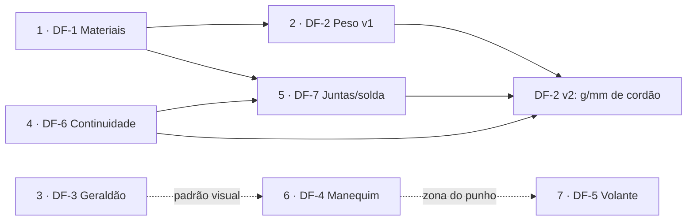

# Specs em Draft — Índice e ordem de desenvolvimento

- **Status geral:** ✅ **todas as 9 features do validador implementadas**: DF-1 (US-6), DF-2 v1+v2 (US-7), DF-3 (US-8), DF-6 (US-9), DF-7 (US-10), DF-4 v1 (US-11), DF-5 (US-12) em 2026-08-16, e DF-22 (US-13/US-14) + DF-23 (US-15/US-16) em 2026-08-31. Pendências residuais registradas em cada draft (DF-4 v2 3D, AC-DF7.2 validação física, validação visual em browser).
- **Documentos irmãos:** [spec.md](spec.md) (MVP), [design.md](design.md) (arquitetura), [rules.md](rules.md) (regras)
- Cada feature tem spec própria em `drafts/` no formato spec-driven (contexto → objetivos →
  requisitos → modelo de dados → módulos → UI → critérios de aceite → questões em aberto →
  plano). Ao ser aprovada e implementada, a spec é promovida para `spec.md` (US/FR) e o
  arquivo em `drafts/` registra o link.
- **Só feature do validador vai para `spec.md`.** Feature de portal (shell, equipe, evolução,
  comunidade, identidade, administração, marca, operação) fecha no próprio draft — `spec.md` é
  a spec do Validador de Gaiola B6, e diluí-la apagaria o recorte. O status de cada uma está
  na linha `**Status:**` do draft, e resumido na tabela abaixo.

## Placar (conferido contra a `main` em 2026-09-02)

| Spec        | Feature                                                                          | Status | Onde fechou                                                                                       |
| ----------- | -------------------------------------------------------------------------------- | ------ | ------------------------------------------------------------------------------------------------- |
| DF-1…DF-7   | Validador: materiais, peso, Geraldão, manequim, volante, continuidade, juntas    | ✅     | `spec.md` US-6…US-12                                                                              |
| DF-8        | Assistente de Regras (IA)                                                        | ✅     | PR #12; gateway SigV4 no #27                                                                      |
| DF-9        | Administração                                                                    | ✅     | PR #12; triagem de sugestões no #43                                                               |
| DF-10       | Gestão de equipe                                                                 | ✅     | PR #28                                                                                            |
| DF-11       | Redesign de interface                                                            | —      | número **reservado** ([plano de design](../docs/plano-implementacao-design.md))                   |
| DF-12…DF-16 | Lote da evolução: shell, maturidade, conhecimento, comunidade, início            | ✅     | PR #33                                                                                            |
| DF-17       | Entrar com Google                                                                | ✅     | PR #36                                                                                            |
| DF-18…DF-20 | Lote das patentes: patentes, catálogo v2.0.0, aferição                           | ✅     | PR #38 (aferição em **onda V1**, 19 dos 51 critérios)                                             |
| DF-21       | Ficha do protótipo                                                               | ✅     | PR #37                                                                                            |
| DF-22…DF-23 | Planos, cotas, trava e vistas                                                    | ✅     | `spec.md` US-13…US-16 (PR #39)                                                                    |
| DF-24       | Menu recolhível e marcas de produto                                              | ✅     | PR #39                                                                                            |
| DF-25       | Vitrine pública                                                                  | ✅     | PR #40                                                                                            |
| DF-26       | Sugestões de dentro da página                                                    | ✅     | PR #43 (sem mural e sem voto na v1)                                                               |
| DF-27       | Cortina "Em breve" em produção                                                   | ✅ N1  | PR #45 (N2 §5.5 opcional, não entrou; **ligar é operação**)                                       |
| DF-28       | Assistente sem conta: demonstração no lugar da degustação                        | 🚧     | draft; substitui a FR-DF27.12                                                                     |
| DF-29       | Rótulos dos pontos na cena: mostrar e ocultar                                    | ✅     | FR-1.7 em `spec.md`                                                                               |
| DF-30       | Módulo de suspensão: tipo por eixo, centros de roda, entre-eixos, corpos         | ✅ v1  | `spec.md` US-17; SUSP.2/SUSP.3 em `rules.md`; pendências em §10 do draft                          |
| DF-31       | Recalcular: re-identificar pontos denominados e reavaliar o checklist            | ✅     | `spec.md` US-18                                                                                   |
| DF-32       | Desfazer e refazer no editor                                                     | ✅     | `spec.md` US-19                                                                                   |
| DF-33       | Calendário de competições: marcos, prazos, informativos e links oficiais         | ✅     | PR #55 + [ADR-012](../docs/adr/012-rota-publica-api.md); vista Mês e revisões ficam para v2 (§10) |
| DF-34       | Regulamento e referências: leitura, navegação por seção e ponte com o assistente | 📝     | draft proposto em 2026-09-06 — **spec apenas**; depende do DF-33                                  |

**Em aberto no backlog:** DF-34, proposto em 2026-09-06 e ainda **sem aprovação para
implementar** (o DF-33, de que ele depende, está implementado). As demais pendências são
residuais e estão nomeadas dentro de cada draft — DF-4 v2 (3D), AC-DF7.2 (validação física),
ondas 2+ da aferição do DF-20, N2 do DF-27, vista Mês do DF-33.

## Ordem de desenvolvimento

A ordem deriva das dependências (materiais fundamentam massa; continuidade fundamenta
juntas; manequim fundamenta volante) e prioriza entregas de valor imediato e baixo risco
antes das features maiores:

| Ordem  | Spec                                               | Feature                                                  | Depende de         | Racional da posição                                                                        |
| ------ | -------------------------------------------------- | -------------------------------------------------------- | ------------------ | ------------------------------------------------------------------------------------------ |
| 1 ✅   | [DF-1](drafts/df1-materiais.md)                    | Material dos tubos (aços) por classe — **implementada**  | —                  | Fundação: propriedades (E, Sy, ρ) desbloqueiam DF-2 e automatizam a equivalência B6.3.3.2  |
| 2 ✅v1 | [DF-2](drafts/df2-estimativa-peso.md)              | Estimativa de peso (v1) — **v1 implementada**            | DF-1               | Valor imediato com juntas contadas por nó; v2 refinada depois de DF-6/DF-7                 |
| 3 ✅   | [DF-3](drafts/df3-geraldao.md)                     | Geraldão no cockpit (toggle) — **implementada**          | —                  | Independente, baixo risco; estabelece o padrão de objeto visual reutilizado por DF-4       |
| 4 ✅   | [DF-6](drafts/df6-continuidade-tubos.md)           | Continuidade de tubos — **implementada**                 | —                  | Declaração física que DF-7 e DF-2 v2 consomem; precisa vir antes delas                     |
| 5 ✅   | [DF-7](drafts/df7-juntas-boca-de-lobo.md)          | Juntas: linha de solda e boca de lobo — **implementada** | DF-6, DF-1         | Núcleo de fabricação; entrega gabaritos 1:1 e habilita DF-2 v2 (g/mm de cordão)            |
| 6 ✅v1 | [DF-4](drafts/df4-manequim-ergonomico.md)          | Manequim ergonômico — **v1 implementada**                | DF-3 (padrão)      | Maior feature do lote; exige fechamento de fontes antropométricas antes de codificar       |
| 7 ✅   | [DF-5](drafts/df5-ancoragem-volante.md)            | Ancoragem do volante — **implementada**                  | DF-4 (opcional)    | Reusa o padrão SUSP.1; a zona recomendada consome o punho do manequim                      |
| 8 ✅   | [DF-22](drafts/df22-planos-cotas.md)               | Planos e cotas — **implementada**                        | —                  | Fecha a edição por número: cota e ângulo viram entrada, não só leitura                     |
| 9 ✅   | [DF-23](drafts/df23-trava-e-vistas.md)             | Trava e vistas de câmera — **implementada**              | DF-22              | Protege o que já foi decidido das ações novas de mover; vistas canônicas em um clique      |
| 10 ✅  | [DF-29](drafts/df29-rotulos-da-cena.md)            | Rótulos dos nós: mostrar/ocultar — **implementada**      | —                  | Um booleano; tira 40 placas de cima da forma quando o olho quer a forma                    |
| 11 ✅  | [DF-30](drafts/df30-suspensao.md)                  | Módulo de suspensão — **v1 implementada**                | US-4, DF-21, DF-23 | A gaiola tem de fechar com o carro: tipo por eixo, centros de roda e entre-eixos conferido |
| 12 ✅  | [DF-31](drafts/df31-recalcular-e-reidentificar.md) | Recalcular pontos e regras — **implementada**            | DF-30              | O motor lê ponto por id; o nó genérico no encontro certo ganha a letra num clique          |
| 13 ✅  | [DF-32](drafts/df32-desfazer-refazer.md)           | Desfazer e refazer — **implementada**                    | DF-31              | Toda ação de ida ganha volta; o recálculo deixa de ser o único caminho sem retorno         |
| 14 ✅  | [DF-33](drafts/df33-calendario-competicoes.md)     | Calendário de competições — **implementada**             | DF-13, DF-15, DF-9 | O problema nº 1 da pesquisa (rotatividade) é não saber o prazo; agora ele tem fonte e data |

## Grafo de dependências

## Resumo de uma linha por spec

- **DF-1 — Materiais:** catálogo de aços (1010/1018/1020/1026/4130 + customizado) por
  classe; %C derivado; equivalência de rigidez/resistência à flexão (B6.3.3.2) vira
  cálculo automático.
- **DF-2 — Peso:** massa em tempo real (tubos por comprimento×seção×densidade + juntas
  soldadas), breakdown por classe, economia de massa na análise de redundância.
- **DF-3 — Geraldão:** gabarito normativo (B6.2.4.3) renderizado translúcido na posição
  correta, com toggle; sem efeito sobre regras ou seleção.
- **DF-4 — Manequim:** piloto 2D paramétrico por percentil (faixa F-P5→M-P95), ângulos
  articulares com faixas ergonômicas recomendadas, leituras de projeto (calcanhar,
  capacete, punho).
- **DF-5 — Volante:** ancoragem central ou mesa L/R com verificação de suporte
  (`STEER.1`, padrão SUSP.1), integrada à análise de remoção e à zona do punho do
  manequim.
- **DF-6 — Continuidade:** declarar quais pares de membros formam um tubo físico único
  através de um nó; defaults inteligentes; base para juntas e massa de solda.
- **DF-7 — Juntas/boca de lobo:** detecção e classificação de juntas (T/Y/K/topo/
  cruzamento), comprimento da linha de contato de solda e gabarito de corte (SVG 1:1)
  por extremidade.
- **DF-8 — Assistente de Regras:** chat de IA em linguagem natural sobre o regulamento
  completo (não só B6), com citações seção+página, via **Bajeiros AI Gateway** (repo
  separado, spec própria); revisado em `docs/revisao-assistente-ia.md`.
- **DF-9 — Administração:** página de operação (usuários, equipes, atividade e uso do
  chat de IA) sobre `users.is_admin`, com log de acesso e log do assistente.
- **DF-10 — Gestão de equipe:** capitania (1 capitã/capitão + até 2 co-capitães) que
  confirma entradas, organograma de funções customizável com responsabilidades
  descritas, visualização em árvore e página inteira no lugar do modal; requisitos de
  maturidade derivados de `Pesquisa de Mercado/praticas-elite.md`. **Implementada.**
- **DF-11 — Redesign de interface:** número **reservado** pelo
  [`docs/plano-implementacao-design.md`](../docs/plano-implementacao-design.md) (13 fases,
  branches `feat/df11-*`); a spec nasce na fase 0 daquele plano.
- **DF-12 — Shell de navegação:** rail Início · Equipe · Ferramentas · Comunidade; Editor
  vira item do hub de Ferramentas (sem tocar a montagem do Viewport — ADR-009); equipe com
  4 abas (Evolução · Pessoas · Conhecimento · Projetos); rótulos do estudo §9.4.
  Estendido pelo **DF-24** (rail recolhível + recursos da página no menu).
- **DF-13 — Evolução da equipe:** maturidade 1–5 por área (6 áreas), critérios verificáveis
  (automáticos via evidência server-side; declarados auditáveis), fila de próximos passos
  derivada, faixa de temporada; motor puro `packages/evolution`. Realiza o RF-5.7 do DF-10.
- **DF-14 — Conhecimento:** diário de decisões numerado, guias com dono (inclui trilha de
  integração de novatos), kits de passagem por saída anunciada; tudo vira evidência do
  DF-13. Ataca a rotatividade (problema nº 1 da pesquisa).
- **DF-15 — Comunidade:** acervo de resultados 2021–2026 publicado com classificação por
  prova, registro canônico das 91 equipes com claim, benchmark por coorte (mediana, piso
  de 8) e "transformar em meta"; sem identidade "SAE", sem PII de pilotos.
- **DF-16 — Início:** página do dia da equipe — 3 próximos passos, atividade, evolução
  compacta, continuar de onde parou, temporada; um endpoint agregador (`GET /me/home`).
- **DF-17 — Entrar com Google:** IdP social no mesmo User Pool (`identity_provider=Google` no
  `/oauth2/authorize`), sem migração e sem mudança no contrato do token; vinculação de conta
  no Cognito preserva o invariante `users.id = sub`. Realiza o item 12.5 do plano de produção.
- **DF-18 — Patentes do protótipo:** oito patentes derivadas dos níveis do DF-13, as quatro
  superiores travadas por resultado de competição do acervo do DF-15; opt-in retroativo da
  capitania, carência de 30 dias na queda, privada por padrão com vitrine opcional.
- **DF-19 — Catálogo de maturidade v2.0.0:** os 51 critérios detalhados (enunciado, o que conta, o
  que não vale, onde registrar, como será aferido); **v1 autodeclarativa**, sem critério oculto e
  sem critério que exija ferramenta específica do portal (RF-4.8).
- **DF-20 — Aferição:** contraprovas que confrontam declaração com o que o portal já mede —
  contradição derruba, indício pergunta, piso de atividade suspende tudo; ausência de dado nunca é
  contraprova. Onda V1 cobre 19 critérios sem ferramenta nova.
- **DF-21 — Ficha do protótipo:** ~70 campos tipados por subsistema, todos preenchíveis à mão;
  o modelo 3D sugere seis deles e nunca sobrescreve; guarda sugerido × projetado × medido para
  registrar a divergência entre o carro idealizado e o construído.
- **DF-22 — Planos e cotas:** a distância entre dois pontos vira entrada (não só leitura), e os
  planos formados por pontos denominados adjacentes ganham toggle no viewport, ângulo medido na
  aresta comum e edição desse ângulo por giro rígido na dobradiça. Derivado da geometria — nada
  entra no `Cage`.
- **DF-23 — Trava e vistas:** `Cage.locked` congela nó, ancoragem ou ponto do volante contra
  TODAS as ações que movem (arrasto, campo, cota, giro, espelho), com marca de forma no 3D e o
  motivo do bloqueio na tela antes da tentativa; mais quatro vistas canônicas de câmera que
  também enquadram.
- **DF-24 — Menu e marcas:** o rail recolhe a só-ícone (a variante `rail-compact` que estava
  desenhada e bloqueada desde a fase 0), o destino selecionado abre embaixo os recursos dele
  (ferramentas, abas de equipe e de comunidade) e as duas ferramentas ganham marca própria —
  categoria à parte do inventário de ícones, com exceção escrita no design-system §8.6.1.
- **DF-25 — Vitrine pública:** o Início de quem não tem conta vira vitrine — marca grande,
  quatro números e um **mapa do Brasil com as fronteiras reais dos 27 estados** (Natural Earth,
  domínio público, gerado por `scripts/build-mapa-uf.mjs`). Duas leituras no mesmo desenho: o
  estado é a forma e o tom, a região é o recorte que acende e o painel detalha. Parágrafo vira
  número + uma linha. O dado é **instantâneo datado no front**, nunca consulta ao banco (Aurora
  escala a zero e a vitrine é a primeira pintura de quem chega). Terceira das quatro marcas de
  produto; inventário de ícones intocado em 23/24. Não reabre a decisão do DF-12: a vitrine mora
  **dentro** do shell.
- **DF-26 — Sugestões:** melhoria, implementação ou problema pedidos de dentro de qualquer
  página, com a página e o tamanho da janela presos ao envio **sozinhos** — e mostrados antes de
  enviar, que é o que separa contexto de telemetria. Fila privada triada na administração, com
  status honesto: recusar **exige** motivo. **Sem mural e sem voto na v1**, por evidência de viés
  e por continuidade com o "benchmark nunca vira ranking" do DF-15. O ciclo fecha in-app, porque
  o portal não manda e-mail.

- **DF-29 — Rótulos da cena:** alternador "Rótulos" na barra do viewport esconde os ids dos
  nós; o selecionado continua rotulado. Estado de sessão, fora do JSON.
- **DF-30 — Suspensão:** tipo por eixo (duplo A, McPherson, braço arrastado/semi-arrastado) define
  os papéis de ancoragem e reconcilia o conjunto; centro de roda por eixo (cubo, espelhado) dá
  bitola e entre-eixos; entre-eixos declarado é conferido por SUSP.2; corpos genéricos (pneu, aro,
  manga, bandejas, amortecedor) com alternadores "Suspensão" e "Ancoragens"; ficha recebe
  entre-eixos, bitolas e tipos como sugestão.

- **DF-31 — Recalcular:** botão no Checklist B6 que re-identifica os pontos denominados pela
  topologia (nó genérico no encontro dos membros que definem a letra vira `SL`, `DL`…), saneia o
  modelo como a importação, reconcilia ancoragens com o tipo de suspensão e reavalia tudo, com
  resumo do que mudou. Nunca toca em nó que já tem letra.

- **DF-32 — Desfazer/refazer:** histórico só da gaiola (`past`/`future`), gesto de arrasto = um
  passo, digitação funde por assinatura em 800 ms, seleção ajustada ao restaurar; botões no painel
  de edição e Ctrl+Z / Ctrl+Shift+Z / Ctrl+Y fora de campo de texto.

- **DF-33 — Calendário de competições:** aba Calendário na Comunidade, pública, com linha do tempo
  do ciclo (Nacional + três regionais), marcos com fonte oficial e `checked_at`, lista com painel,
  recorte pessoal (competições inscritas ou de interesse, categoria de inscrição), marcos da própria temporada (Equipe › Projetos) na mesma linha do tempo e lista, `.ics`, curadoria por colagem na administração.
  Disclaimer fixo obrigatório.
- **DF-34 — Regulamento e referências:** página Regulamento sob Ferramentas com índice completo
  (metadado do manifest do gateway, sem texto), navegação por seção e página, versões por
  competição, referências do acervo do DF-33 e o chip de citação do assistente abrindo a seção.
  Modo `ponteiro` (v1, abre o PDF oficial na página) e modo `embutido` (v2, só com autorização).
  Disclaimer fixo obrigatório.

## Lote "Evolução das equipes" (DF-12…DF-16) — ✅ implementado em 2026-08-30 (PR #33)

Direção de produto (2026-08-29): a evolução das equipes é o core; ferramentas são meios.
Decisão em [`docs/adr/010-evolucao-maturidade.md`](../docs/adr/010-evolucao-maturidade.md);
fases de execução (EV-0…EV-8) em
[`docs/plano-implementacao-evolucao.md`](../docs/plano-implementacao-evolucao.md); desenho
aprovado no canvas
["Bajeiros — Experiência de Evolução"](https://claude.ai/code/artifact/0a10a019-dfc6-46bb-9b28-3f7ca7cf6f8b).

| Ordem | Spec                                          | Depende de             | Racional da posição                                      |
| ----- | --------------------------------------------- | ---------------------- | -------------------------------------------------------- |
| 1 ✅  | [DF-13](drafts/df13-evolucao-maturidade.md)   | DF-10                  | Motor e evidências primeiro — tudo o mais consome daqui  |
| 2 ✅  | [DF-14](drafts/df14-conhecimento.md)          | DF-10                  | Produtor da área `conhecimento`; anti-rotatividade       |
| 3 ✅  | [DF-12](drafts/df12-shell-navegacao.md)       | design fases 0 e 6     | O chrome que dá endereço às telas novas                  |
| 4 ✅  | [DF-16](drafts/df16-inicio.md)                | DF-12, DF-13, DF-14    | Agrega; sem fontes não há o que mostrar                  |
| 5 ✅  | [DF-15](drafts/df15-comunidade-resultados.md) | DF-12 (DF-13 p/ metas) | Independente no dado; fecha o ciclo com o benchmark      |
| 6 ✅  | [DF-18](drafts/df18-patentes-prototipo.md)    | DF-13, DF-15, DF-19    | A patente é o rosto do modelo; sem ela nada é contável   |
| 7 ✅  | [DF-19](drafts/df19-catalogo-maturidade.md)   | DF-13                  | Define o que alimenta os níveis na v1 — vem com o DF-18  |
| 8 ✅  | [DF-20](drafts/df20-afericao-declaracoes.md)  | DF-19, DF-13, DF-14    | Saída do autodeclarativo; só depois de 1 temporada de v1 |
| 9 ✅  | [DF-21](drafts/df21-ficha-prototipo.md)       | DF-12, motor B6        | Independente; destrava a onda V2 do DF-20 e o Anexo B    |

## Lote das patentes (DF-18…DF-20) — proposto em 2026-08-30, ✅ implementado em 2026-08-31 (PR #38)

Direção de produto: a medição de maturidade precisa de **um rosto que a equipe queira mostrar** e
de **validação externa**. Decisão em
[`docs/adr/011-patentes-gamificacao.md`](../docs/adr/011-patentes-gamificacao.md), que **emenda as
decisões 1 e 2 do ADR-010**; desenho no canvas
["Patentes da Estrada"](https://claude.ai/code/artifact/aca0d047-5859-43fd-9b58-5e07d3a7d921);
fases EV-9 e EV-10 no plano de implementação.

- **DF-18** — oito patentes do **protótipo da temporada**, derivadas dos níveis do DF-13, com as
  quatro superiores travadas por resultado de competição do acervo do DF-15. **Opt-in da
  capitania**: nada disso existe até a equipe pedir para ser avaliada, e a ativação é retroativa.
  Privada por padrão, com vitrine opcional; nunca uma listagem ordenada.
- **DF-19** — o catálogo de 51 critérios **detalhado**: enunciado, o que conta como cumprido, o
  que não vale, onde registrar e por qual dado será aferido depois. **A v1 é autodeclarativa**
  (`CATALOG_MODE = 'declarado'`, catálogo v2.0.0, sem critério oculto).
- **DF-20** — a saída do autodeclarativo: contraprovas que confrontam declaração com o que o portal
  já mede. Três mecanismos (contradição direta derruba; indício quantitativo pergunta; piso de
  atividade suspende tudo com um aviso só). A onda V1 cobre 19 critérios **sem ferramenta nova**.

**Estado (2026-08-31): as três specs implementadas de ponta a ponta** — catálogo `2.0.0` com os
51 critérios detalhados e `CATALOG_MODE`, escada de patentes em `packages/evolution/ranks.ts`,
contraprovas em `counter.ts`, migrações `0008` (patentes e opt-in) e `0010` (reafirmação e
mediana de massa por classe), opt-in e patente na API, faixa da patente, painel de ativação,
aviso de promoção, cartaz PNG no cliente e UI do critério suspenso.

Três coisas que a implementação decidiu e que valem saber:

1. **O DF-20 fica ligado por variável de ambiente** (`EVOLUTION_MODE`, default `declarado`), não
   por deploy. O gate da spec — uma temporada de v1 autodeclarativa acumulada — é de produto, e
   virar o modo não exige migração nenhuma (AC-DF19.10).
2. **A onda V2 do `DIN-3.x` deixou de estar bloqueada:** a ficha do DF-21 deu a classe do
   projeto (ocupantes + tração), então a mediana de massa compara só protótipos comparáveis.
3. **O emblema na Comunidade ficou de fora** por respeito à RF-6.3: a web só tem a listagem de
   equipes do acervo, e patente de terceiro não entra em agregado. A rota já devolve a vitrine
   (`GET /community/teams/:id`); a tela entra com o perfil de equipe, que é outra spec.

## DF-21 — Ficha do protótipo (proposto em 2026-08-30, ✅ implementada em 2026-08-31, PR #37)

Lacuna encontrada ao escrever o DF-19: **17 dos 51 critérios se apoiam em informação de projeto
que o portal não tem onde guardar.** Hoje `projects` tem `name`, `description` e os snapshots da
gaiola — e nada sobre entre-eixos, massa alvo, curso da suspensão, mola do CVT ou pneu.

A [ficha do protótipo](drafts/df21-ficha-prototipo.md) é feature **independente da maturidade e do
validador**: ~70 campos tipados em 9 seções, **todos preenchíveis à mão**. Onde o modelo 3D existe,
6 campos ganham sugestão com um botão "usar" — oferta, nunca preenchimento automático, e a
sugestão jamais persiste ou sobrescreve. Guarda três leituras do mesmo número (sugerido ×
projetado × medido), porque **a divergência entre o protótipo idealizado e o construído é o
produto**, não ruído. Histórico por campo e exportação. Vale por si — inspeção, relatório, geração
seguinte, comparação com a comunidade. Efeitos colaterais: destrava a onda V2 do DF-20 (classe de
projeto), tira `EST-4.1`/`DOC-4.2` da condição de "ferramenta futura" e dá conteúdo concreto aos
kits de passagem do DF-14. Fase **EV-11**, executada antes do EV-10 — e foi ela que destravou
a onda V2 do `DIN-3.x`, que o DF-20 §8.1 dava como bloqueada.

**Estado (2026-08-30): implementada** — `packages/datasheet` (catálogo v1.0.0 com 78 campos em 9
seções, sugestões, validação e progresso), migração `0009`, módulo `datasheet` na API (leitura,
escrita parcial com lock por campo, histórico, dispensas, exportação Markdown/CSV) e a página de
projeto com as três abas. Fora da entrega, por dependerem de decisão ou de outra spec: kit de
passagem por cargo (a amarração seção → cargo é a questão aberta §12.5) e o catálogo de
maturidade `2.1.0` — que só troca o campo "onde registrar" dos 17 critérios que hoje apontam
para link externo, agora que a ficha existe. As **medianas por classe** deixaram de ser
pendência: `evolution_mass_median(classe)` entrou com o DF-20 e é o que sustenta o indício de
massa do `DIN-3.x`.

**Estado (2026-08-30): as cinco specs implementadas de ponta a ponta** — motor puro,
banco, API, produtores de evidência e todas as superfícies, sobre a fase 0 do plano de
design (tokens, guardas, iconografia). O que continua **pendente** e é decisão de
gente, não de código:

- **ADR-010 segue `proposto`** — vira `aceito` na revisão do product owner.
- **Catálogo de 51 critérios não foi calibrado com equipe real.** É a lista mais barata
  de mudar agora e a mais cara depois; o gate de piloto (2–3 equipes, ≥ 3 semanas) entre
  EV-M2 e o GA existe exatamente para isso.
- **Vocabulário fail/manual** — INFRAÇÃO/PRESENCIAL (design-system §11.3, o que o código
  usa) × NÃO CONFORME / VERIFICAÇÃO PRESENCIAL (estudo §9.4 + canvas). Mudar é editar
  `apps/web/src/icons/statusIcon.tsx`, nunca telas.
- **Base legal do conteúdo pós-exclusão** (DF-14 §8.3) — revisão jurídica antes do GA.
- **Acervo do DF-15 não foi ingerido** em nenhum ambiente: o script roda em dry-run por
  padrão e o `--apply` é ato deliberado, com o diff conferido no PR.

## DF-27 — Cortina "Em breve" em produção (proposto em 2026-09-02, ✅ N1 implementada no mesmo dia, PR #45)

Prod e staging rodam o mesmo artefato: tudo que entra em `main` aparece em `bajeiros.com.br` no
mesmo dia — inclusive a vitrine do DF-25, que ainda não está pronta para receber gente. A
[cortina "Em breve"](drafts/df27-cortina-em-breve.md) troca o portal por uma tela única em
**produção apenas**, mantendo o login inteiro e liberando o portal real para quem tem
`users.is_admin` (DF-9). Staging e o dev local não mudam.

A decisão de arquitetura é **cortina de render, não muro de borda**: um campo `comingSoon` no
`config.json` por ambiente e um ramo no `App` que impede o `Shell` de montar. Isso alterna sem
rebuild (publicar um arquivo + invalidar um caminho) e não inventa papel nenhum além do
administrador que já existe. A camada de borda (CloudFront Function servindo `em-breve.html`)
fica especificada em §5.5 como fase 2 opcional — ela fecha buscador e visitante casual, mas
**não pode** fechar quem pede a rota de login, porque login aberto obriga a servir o app.
O §9 escreve esses limites em vez de deixá-los para a descoberta.

**Estado (2026-09-02): N1 implementada** — `comingSoon` no `config.json` por ambiente
(`deploy.yml`), decisão pura em `apps/web/src/cortina.ts`, `ComingSoon.tsx` no lugar do `Portal`
(o `Shell` não monta), `ASSISTANT_ANON_DAILY` fechando a degustação sem conta em prod
(variável **removida** pelo DF-28, que fechou a degustação em todo ambiente),
`noindex = true` no env de prod e a seção de operação no runbook. **N2 (borda) não entrou.**
Ligar a cortina é ato de operação, não deploy: variable `COMING_SOON=true` + apply + publicar o
`config.json`.

## DF-28 — Assistente sem conta: demonstração no lugar da degustação (proposto em 2026-09-03)

A degustação anônima do assistente (2 perguntas por dia por IP, do `48add3e`) **acaba**. Ela era
a única rota do portal que gastava LLM sem conta, e a contenção era um `Map` em memória de
processo — em Lambda, o teto real nunca foi 2 por dia, foi 2 por dia **por instância viva**. Como
anônimo não entra no `assistant_log` por promessa do aviso de transparência, nunca existiu o
número que justificaria o funil: quantas contas a degustação criou.

No lugar do painel bloqueado, a [demonstração](drafts/df28-assistente-sem-conta.md): uma conversa
encenada de quatro turnos (pergunta → resposta com citação → continuação → resposta), desenhada
pelos **mesmos componentes** do chat real, rodando **uma passada** e parando no estado final. O
convite a criar conta fica embaixo, no lugar onde a pessoa acabou de ver o valor.

A porta fecha **na API**, não na tela: o módulo `/api/v1/assistant` sai da exceção que ocupava no
`app.ts` desde o DF-8 e passa a ser montado depois do `requireAuth` global. Somem junto a quota
por IP, o `rateKey` anônimo, a variável `ASSISTANT_ANON_DAILY` (API e Terraform) e o middleware
`optionalAuth`, que ficaria sem nenhum call site. Isso **substitui a FR-DF27.12** — sem conta não
há assistente em ambiente nenhum, o que é mais fechado que o `0` que a cortina usava.

## DF-29 — Rótulos dos pontos na cena (proposto e ✅ implementado em 2026-09-05)

Todo nó carrega um rótulo `drei/Html` com o id, e numa gaiola completa são 30 a 40 placas em
cima exatamente do que a pessoa quer ver quando avalia **forma**. O [alternador
"Rótulos"](drafts/df29-rotulos-da-cena.md) na barra do viewport esconde todos e deixa só o nó
selecionado rotulado. É estado de sessão, como Geraldão e Piloto — não vai para o JSON. Na mesma
leva, o DF-22 ganhou a §11: a **cota flutuante** sobre o tubo selecionado (Enter aplica, Esc
descarta), a segunda entrada para a mesma ação do comprimento editável do inspetor.

## DF-30 — Módulo de suspensão (proposto e ✅ v1 implementado em 2026-09-05)

As 20 ancoragens de US-4 assumiam duplo A nos dois eixos sem dizer, e a gaiola não sabia o que
é uma roda. O [módulo](drafts/df30-suspensao.md) torna isso configuração de projeto, opt-in e no
JSON: **tipo por eixo** (os ids do catálogo da ficha), com o conjunto de ancoragens **derivado do
tipo** e reconciliado ao trocar; **centro de roda** por eixo (um ponto, espelhado), que dá bitola
e entre-eixos medidos; **entre-eixos declarado** conferido por `SUSP.2` (± 5 mm) e conjunto de
ancoragens conferido por `SUSP.3`; **corpos genéricos** (pneu, aro, manga, bandejas, amortecedor)
como cilindros derivados, sem clique e sem massa, com dois alternadores no viewport; e a ficha
recebendo entre-eixos, bitolas e tipos como sugestão. O template nasce configurado (duplo A na
dianteira, braço arrastado na traseira, 22×7-10, entre-eixos 1121 mm). Fora da v1, nomeado no §10 do draft: solo derivado do pneu,
largura total × regulamento (após conferência da Emenda 7), bitola declarada, cinemática.

## DF-31 — Recalcular: re-identificação dos pontos denominados (proposto e ✅ implementado em 2026-09-06)

O motor B6 lê os pontos pelo **id do nó** (`p('CL')`, `has('DL')`): quem modela livre cria `N7`
e as regras que dependem daquele ponto não o enxergam — no próprio template, a cadeia do SIM em
B6.2.4.5 só era conferida com `DL` presente. O [botão "Recalcular pontos e
regras"](drafts/df31-recalcular-e-reidentificar.md) no Checklist B6 identifica a letra pelo
**encontro de tipos de membro** (A = RRH + ALC/LFS, C = RHO + FBM_UP, D = FBM_UP + FBM_LOW/DLC…),
renomeia só o que é inequívoco e nunca um nó que já tem letra, saneia o modelo como a importação,
reconcilia as ancoragens com o tipo de cada eixo (DF-30) e reavalia tudo, mostrando o resumo. No
template, `NL/NR → DL/DR`. Importar JSON continua sem renomear: é ação explícita.

## DF-32 — Desfazer e refazer (proposto e ✅ implementado em 2026-09-06)

O editor tinha ~40 ações de ida e nenhuma de volta — e o DF-31 registrou o risco por escrito. O
[histórico](drafts/df32-desfazer-refazer.md) envolve o `set` do store: quando a **gaiola** muda,
a anterior vai para `past`. Só a gaiola: seleção, alternadores e câmera não são edição. Dois
mecanismos dão granularidade humana — o **gesto** do arrasto (um passo do `pointerdown` ao
`pointerup`) e a **assinatura** da mudança (chaves e nós tocados) que funde digitação em 800 ms.
Restaurar ajusta a seleção ao que existe. Botões Desfazer/Refazer no cabeçalho do painel de edição
e os atalhos clássicos fora de campo de texto. Importar, template e recálculo são desfazíveis.

## DF-33 e DF-34 — Calendário de competições e Regulamento (propostos em 2026-09-06)

Pedido do dono do produto na proposta: **especificar, não implementar.** O DF-33 foi implementado
depois, no PR #55; o DF-34 continua spec apenas. Duas seções novas, desenhadas juntas
no canvas ["Calendário e Regulamento"](https://claude.ai/code/artifact/03837ff6-b954-4cf4-a13b-2a6325a4ac3b)
e com um mesmo disclaimer fixo em toda página ("O Portal é um facilitador de acesso à informação
e não substitui a leitura integral do material direto da fonte…").

- **[DF-33](drafts/df33-calendario-competicoes.md)** — o que a organização publica em quatro
  páginas, ~30 informativos por competição e um grupo de Telegram vira **um calendário do ciclo**
  (Nacional 2027 + Regionais 2026): linha do tempo e lista, cada marco com a fonte e a data em que
  foi conferido. Entra por curadoria na administração (colagem da tabela oficial), não por raspagem:
  o site bloqueou cliente não-browser e mudou URLs sem redirecionar. Dá ao DF-13/DF-16 o "próximo
  prazo" que eles prometem e ainda não têm. **Implementado no PR #55**; a rota pública cacheada na
  borda (§10.2) virou o [ADR-012](../docs/adr/012-rota-publica-api.md).
- **[DF-34](drafts/df34-regulamento-leitor.md)** — o índice do regulamento (1 360 blocos, só
  metadado: id, título nos níveis 0–2, página) vira uma página navegável, e a citação do assistente
  vira link para a seção na **versão citada**. Ler na íntegra dentro do portal é o modo `embutido`,
  que só liga com autorização escrita da organização — o `ponteiro` (abre o PDF oficial na página)
  entrega todo o resto sem reproduzir uma linha do texto.

Ordem: DF-33 antes do DF-34 (o acervo de documentos-fonte é compartilhado).
