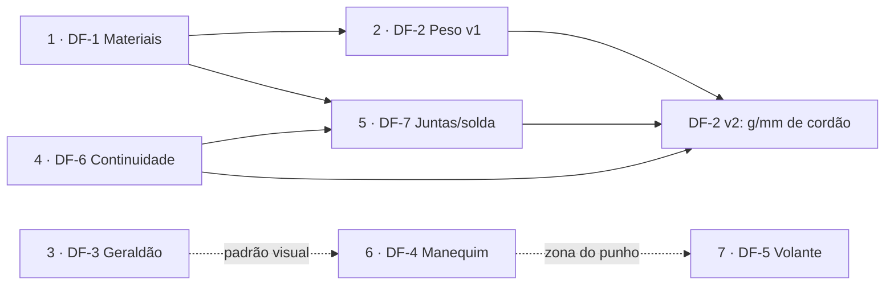

# Specs em Draft — Índice e ordem de desenvolvimento

- **Status geral:** ✅ **todas as 7 features implementadas** (2026-08-16): DF-1 (US-6), DF-2 v1+v2 (US-7), DF-3 (US-8), DF-6 (US-9), DF-7 (US-10), DF-4 v1 (US-11), DF-5 (US-12). Pendências residuais registradas em cada draft (DF-4 v2 3D, AC-DF7.2 validação física, validação visual em browser).
- **Documentos irmãos:** [spec.md](spec.md) (MVP), [design.md](design.md) (arquitetura), [rules.md](rules.md) (regras)
- Cada feature tem spec própria em `drafts/` no formato spec-driven (contexto → objetivos →
  requisitos → modelo de dados → módulos → UI → critérios de aceite → questões em aberto →
  plano). Ao ser aprovada e implementada, a spec é promovida para `spec.md` (US/FR) e o
  arquivo em `drafts/` registra o link.

## Ordem de desenvolvimento

A ordem deriva das dependências (materiais fundamentam massa; continuidade fundamenta
juntas; manequim fundamenta volante) e prioriza entregas de valor imediato e baixo risco
antes das features maiores:

| Ordem  | Spec                                      | Feature                                                  | Depende de      | Racional da posição                                                                       |
| ------ | ----------------------------------------- | -------------------------------------------------------- | --------------- | ----------------------------------------------------------------------------------------- |
| 1 ✅   | [DF-1](drafts/df1-materiais.md)           | Material dos tubos (aços) por classe — **implementada**  | —               | Fundação: propriedades (E, Sy, ρ) desbloqueiam DF-2 e automatizam a equivalência B6.3.3.2 |
| 2 ✅v1 | [DF-2](drafts/df2-estimativa-peso.md)     | Estimativa de peso (v1) — **v1 implementada**            | DF-1            | Valor imediato com juntas contadas por nó; v2 refinada depois de DF-6/DF-7                |
| 3 ✅   | [DF-3](drafts/df3-geraldao.md)            | Geraldão no cockpit (toggle) — **implementada**          | —               | Independente, baixo risco; estabelece o padrão de objeto visual reutilizado por DF-4      |
| 4 ✅   | [DF-6](drafts/df6-continuidade-tubos.md)  | Continuidade de tubos — **implementada**                 | —               | Declaração física que DF-7 e DF-2 v2 consomem; precisa vir antes delas                    |
| 5 ✅   | [DF-7](drafts/df7-juntas-boca-de-lobo.md) | Juntas: linha de solda e boca de lobo — **implementada** | DF-6, DF-1      | Núcleo de fabricação; entrega gabaritos 1:1 e habilita DF-2 v2 (g/mm de cordão)           |
| 6 ✅v1 | [DF-4](drafts/df4-manequim-ergonomico.md) | Manequim ergonômico — **v1 implementada**                | DF-3 (padrão)   | Maior feature do lote; exige fechamento de fontes antropométricas antes de codificar      |
| 7 ✅   | [DF-5](drafts/df5-ancoragem-volante.md)   | Ancoragem do volante — **implementada**                  | DF-4 (opcional) | Reusa o padrão SUSP.1; a zona recomendada consome o punho do manequim                     |

## Grafo de dependências

## Resumo de uma linha por spec

- **DF-1 — Materiais:** catálogo de aços (1010/1018/1020/1026/4130 + customizado) por
  classe; %C derivado; equivalência de rigidez/resistência à flexão (B6.3.3.2) vira
  cálculo automático.
- **DF-2 — Peso:** massa em tempo real (tubos por comprimento×seção×densidade + juntas
  soldadas), breakdown por classe, economia de massa na análise de redundância.
- **DF-3 — Geraldão:** gabarito normativo (B6.2.4.3) renderizado translúcido na posição
  correta, com toggle; sem efeito sobre regras ou seleção.
- **DF-4 — Manequim:** piloto 2D paramétrico por percentil (faixa F-P5→M-P95), ângulos
  articulares com faixas ergonômicas recomendadas, leituras de projeto (calcanhar,
  capacete, punho).
- **DF-5 — Volante:** ancoragem central ou mesa L/R com verificação de suporte
  (`STEER.1`, padrão SUSP.1), integrada à análise de remoção e à zona do punho do
  manequim.
- **DF-6 — Continuidade:** declarar quais pares de membros formam um tubo físico único
  através de um nó; defaults inteligentes; base para juntas e massa de solda.
- **DF-7 — Juntas/boca de lobo:** detecção e classificação de juntas (T/Y/K/topo/
  cruzamento), comprimento da linha de contato de solda e gabarito de corte (SVG 1:1)
  por extremidade.
- **DF-8 — Assistente de Regras:** chat de IA em linguagem natural sobre o regulamento
  completo (não só B6), com citações seção+página, via **Bajeiros AI Gateway** (repo
  separado, spec própria); revisado em `docs/revisao-assistente-ia.md`.
- **DF-9 — Administração:** página de operação (usuários, equipes, atividade e uso do
  chat de IA) sobre `users.is_admin`, com log de acesso e log do assistente.
- **DF-10 — Gestão de equipe:** capitania (1 capitã/capitão + até 2 co-capitães) que
  confirma entradas, organograma de funções customizável com responsabilidades
  descritas, visualização em árvore e página inteira no lugar do modal; requisitos de
  maturidade derivados de `Pesquisa de Mercado/praticas-elite.md`. **Implementada.**
- **DF-11 — Redesign de interface:** número **reservado** pelo
  [`docs/plano-implementacao-design.md`](../docs/plano-implementacao-design.md) (13 fases,
  branches `feat/df11-*`); a spec nasce na fase 0 daquele plano.
- **DF-12 — Shell de navegação:** rail Início · Equipe · Ferramentas · Comunidade; Editor
  vira item do hub de Ferramentas (sem tocar a montagem do Viewport — ADR-009); equipe com
  4 abas (Evolução · Pessoas · Conhecimento · Projetos); rótulos do estudo §9.4.
- **DF-13 — Evolução da equipe:** maturidade 1–5 por área (6 áreas), critérios verificáveis
  (automáticos via evidência server-side; declarados auditáveis), fila de próximos passos
  derivada, faixa de temporada; motor puro `packages/evolution`. Realiza o RF-5.7 do DF-10.
- **DF-14 — Conhecimento:** diário de decisões numerado, guias com dono (inclui trilha de
  integração de novatos), kits de passagem por saída anunciada; tudo vira evidência do
  DF-13. Ataca a rotatividade (problema nº 1 da pesquisa).
- **DF-15 — Comunidade:** acervo de resultados 2021–2026 publicado com classificação por
  prova, registro canônico das 91 equipes com claim, benchmark por coorte (mediana, piso
  de 8) e "transformar em meta"; sem identidade "SAE", sem PII de pilotos.
- **DF-16 — Início:** página do dia da equipe — 3 próximos passos, atividade, evolução
  compacta, continuar de onde parou, temporada; um endpoint agregador (`GET /me/home`).
- **DF-18 — Patentes do protótipo:** oito patentes derivadas dos níveis do DF-13, as quatro
  superiores travadas por resultado de competição do acervo do DF-15; opt-in retroativo da
  capitania, carência de 30 dias na queda, privada por padrão com vitrine opcional.
- **DF-19 — Catálogo de maturidade v2.0.0:** os 51 critérios detalhados (enunciado, o que conta, o
  que não vale, onde registrar, como será aferido); **v1 autodeclarativa**, sem critério oculto e
  sem critério que exija ferramenta específica do portal (RF-4.8).
- **DF-20 — Aferição:** contraprovas que confrontam declaração com o que o portal já mede —
  contradição derruba, indício pergunta, piso de atividade suspende tudo; ausência de dado nunca é
  contraprova. Onda V1 cobre 19 critérios sem ferramenta nova.
- **DF-21 — Ficha do protótipo:** ~70 campos tipados por subsistema, todos preenchíveis à mão;
  o modelo 3D sugere seis deles e nunca sobrescreve; guarda sugerido × projetado × medido para
  registrar a divergência entre o carro idealizado e o construído.

## Lote "Evolução das equipes" (DF-12…DF-16)

Direção de produto (2026-08-29): a evolução das equipes é o core; ferramentas são meios.
Decisão em [`docs/adr/010-evolucao-maturidade.md`](../docs/adr/010-evolucao-maturidade.md);
fases de execução (EV-0…EV-8) em
[`docs/plano-implementacao-evolucao.md`](../docs/plano-implementacao-evolucao.md); desenho
aprovado no canvas
["Bajeiros — Experiência de Evolução"](https://claude.ai/code/artifact/0a10a019-dfc6-46bb-9b28-3f7ca7cf6f8b).

| Ordem | Spec                                          | Depende de             | Racional da posição                                      |
| ----- | --------------------------------------------- | ---------------------- | -------------------------------------------------------- |
| 1 ✅  | [DF-13](drafts/df13-evolucao-maturidade.md)   | DF-10                  | Motor e evidências primeiro — tudo o mais consome daqui  |
| 2 ✅  | [DF-14](drafts/df14-conhecimento.md)          | DF-10                  | Produtor da área `conhecimento`; anti-rotatividade       |
| 3 ✅  | [DF-12](drafts/df12-shell-navegacao.md)       | design fases 0 e 6     | O chrome que dá endereço às telas novas                  |
| 4 ✅  | [DF-16](drafts/df16-inicio.md)                | DF-12, DF-13, DF-14    | Agrega; sem fontes não há o que mostrar                  |
| 5 ✅  | [DF-15](drafts/df15-comunidade-resultados.md) | DF-12 (DF-13 p/ metas) | Independente no dado; fecha o ciclo com o benchmark      |
| 6 📝  | [DF-18](drafts/df18-patentes-prototipo.md)    | DF-13, DF-15, DF-19    | A patente é o rosto do modelo; sem ela nada é contável   |
| 7 📝  | [DF-19](drafts/df19-catalogo-maturidade.md)   | DF-13                  | Define o que alimenta os níveis na v1 — vem com o DF-18  |
| 8 📝  | [DF-20](drafts/df20-afericao-declaracoes.md)  | DF-19, DF-13, DF-14    | Saída do autodeclarativo; só depois de 1 temporada de v1 |
| 9 📝  | [DF-21](drafts/df21-ficha-prototipo.md)       | DF-12, motor B6        | Independente; destrava a onda V2 do DF-20 e o Anexo B    |

## Lote das patentes (DF-18…DF-20) — proposto em 2026-08-30

Direção de produto: a medição de maturidade precisa de **um rosto que a equipe queira mostrar** e
de **validação externa**. Decisão em
[`docs/adr/011-patentes-gamificacao.md`](../docs/adr/011-patentes-gamificacao.md), que **emenda as
decisões 1 e 2 do ADR-010**; desenho no canvas
["Patentes da Estrada"](https://claude.ai/code/artifact/aca0d047-5859-43fd-9b58-5e07d3a7d921);
fases EV-9 e EV-10 no plano de implementação.

- **DF-18** — oito patentes do **protótipo da temporada**, derivadas dos níveis do DF-13, com as
  quatro superiores travadas por resultado de competição do acervo do DF-15. **Opt-in da
  capitania**: nada disso existe até a equipe pedir para ser avaliada, e a ativação é retroativa.
  Privada por padrão, com vitrine opcional; nunca uma listagem ordenada.
- **DF-19** — o catálogo de 51 critérios **detalhado**: enunciado, o que conta como cumprido, o
  que não vale, onde registrar e por qual dado será aferido depois. **A v1 é autodeclarativa**
  (`CATALOG_MODE = 'declarado'`, catálogo v2.0.0, sem critério oculto).
- **DF-20** — a saída do autodeclarativo: contraprovas que confrontam declaração com o que o portal
  já mede. Três mecanismos (contradição direta derruba; indício quantitativo pergunta; piso de
  atividade suspende tudo com um aviso só). A onda V1 cobre 19 critérios **sem ferramenta nova**.

## DF-21 — Ficha do protótipo (proposto em 2026-08-30)

Lacuna encontrada ao escrever o DF-19: **17 dos 51 critérios se apoiam em informação de projeto
que o portal não tem onde guardar.** Hoje `projects` tem `name`, `description` e os snapshots da
gaiola — e nada sobre entre-eixos, massa alvo, curso da suspensão, mola do CVT ou pneu.

A [ficha do protótipo](drafts/df21-ficha-prototipo.md) é feature **independente da maturidade e do
validador**: ~70 campos tipados em 9 seções, **todos preenchíveis à mão**. Onde o modelo 3D existe,
6 campos ganham sugestão com um botão "usar" — oferta, nunca preenchimento automático, e a
sugestão jamais persiste ou sobrescreve. Guarda três leituras do mesmo número (sugerido ×
projetado × medido), porque **a divergência entre o protótipo idealizado e o construído é o
produto**, não ruído. Histórico por campo e exportação. Vale por si — inspeção, relatório, geração
seguinte, comparação com a comunidade. Efeitos colaterais: destrava a onda V2 do DF-20 (classe de
projeto), tira `EST-4.1`/`DOC-4.2` da condição de "ferramenta futura" e dá conteúdo concreto aos
kits de passagem do DF-14. Fase **EV-11**, executável antes do EV-10.

**Estado (2026-08-30): as cinco specs implementadas de ponta a ponta** — motor puro,
banco, API, produtores de evidência e todas as superfícies, sobre a fase 0 do plano de
design (tokens, guardas, iconografia). O que continua **pendente** e é decisão de
gente, não de código:

- **ADR-010 segue `proposto`** — vira `aceito` na revisão do product owner.
- **Catálogo de 51 critérios não foi calibrado com equipe real.** É a lista mais barata
  de mudar agora e a mais cara depois; o gate de piloto (2–3 equipes, ≥ 3 semanas) entre
  EV-M2 e o GA existe exatamente para isso.
- **Vocabulário fail/manual** — INFRAÇÃO/PRESENCIAL (design-system §11.3, o que o código
  usa) × NÃO CONFORME / VERIFICAÇÃO PRESENCIAL (estudo §9.4 + canvas). Mudar é editar
  `apps/web/src/icons/statusIcon.tsx`, nunca telas.
- **Base legal do conteúdo pós-exclusão** (DF-14 §8.3) — revisão jurídica antes do GA.
- **Acervo do DF-15 não foi ingerido** em nenhum ambiente: o script roda em dry-run por
  padrão e o `--apply` é ato deliberado, com o diff conferido no PR.
