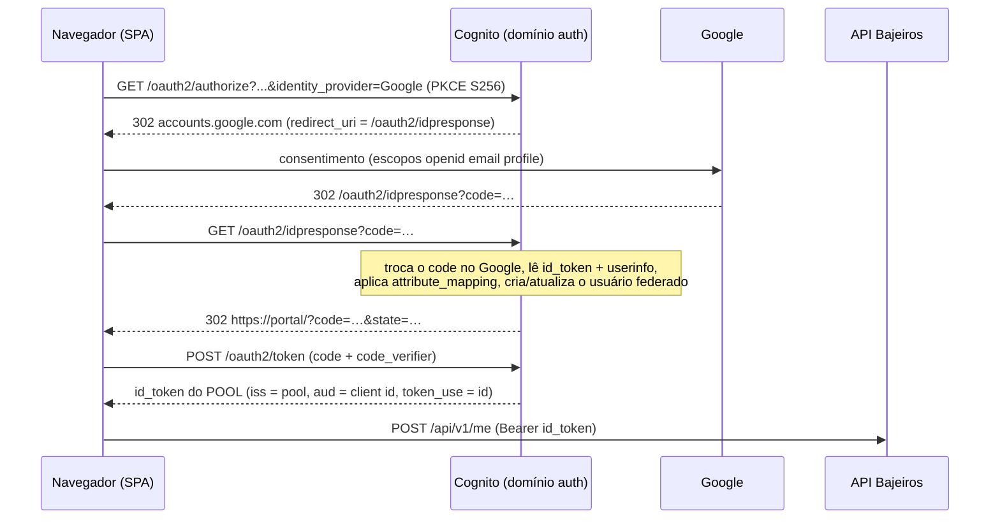

# DF-17 — Entrar com Google (IdP social no Cognito)

> Rascunho de feature. Realiza a promessa registrada no
> [ADR-003](../../docs/adr/003-cognito-identidade.md): "o Managed Login (…) já prepara o IdP
> Google (fase 12), que exige o domínio OAuth de qualquer forma". Fecha o item **12.5** do
> [plano de produção v2](../../docs/plano-producao-v2.md).

## 1. Contexto e motivação

Hoje entrar no portal exige criar uma senha no Managed Login do Cognito: e-mail, senha de 12+
caracteres com 4 classes de caracteres, confirmação por código, e MFA TOTP opcional. O público
são estudantes de equipe Baja em fim de semestre — cada passo entre "quero ver o portal" e
"estou dentro" custa gente. A conta institucional (`@usp.br`, `@ufmg.br`, `@aluno.ifsp.edu.br`)
é quase sempre Google Workspace, e a conta pessoal é quase sempre Gmail.

O trabalho de base já está feito: Managed Login v2 ligado, domínio OAuth provisionado
(`bajeiros-staging.auth.sa-east-1.amazoncognito.com`), code flow + PKCE no SPA
(`packages/auth`), e a API já valida o ID token do pool por JWKS. Adicionar o Google é
configurar um provedor de identidade no mesmo pool — **não** é um segundo sistema de login.

## 2. Objetivos

| #   | Objetivo                                                                                    |
| --- | ------------------------------------------------------------------------------------------- |
| O1  | Entrar e cadastrar com a conta Google em 1 clique, sem senha e sem código de confirmação    |
| O2  | Zero mudança no contrato do token: a API continua recebendo o ID token do **pool**          |
| O3  | Preservar o invariante `users.id = sub` — uma pessoa, um `sub`, independente de como entrou |
| O4  | Nenhuma migração de banco e nenhuma mudança em RLS, policy layer ou módulos da API          |
| O5  | Colisão de e-mail (conta com senha × conta Google) resolvida sem dead-end para o usuário    |

### Não-objetivos (desta feature)

- Outros IdPs (Apple, Microsoft/Entra, Facebook). O desenho é genérico, a entrega é só Google.
- Login com domínio institucional via SAML — outra faixa de preço (§8.3) e outra spec.
- Foto de perfil do Google (`picture`): exigiria alargar o `img-src` da CSP para
  `lh3.googleusercontent.com`, contra o objetivo C2 já registrado no Terraform.
- Desvincular Google de uma conta pela UI (v2, quando existir >1 IdP).
- Trocar o modo `dev` (`AUTH_MODE=dev`, emissor local) — segue igual.

## 3. Pesquisa: como o Cognito faz login com Google

### 3.1 O fluxo

Google entra como **provedor de identidade do User Pool**, não como um segundo login. O SPA
continua falando só com o domínio do Cognito; quem fala com o Google é o Cognito.



O passo do `identity_provider=Google` no `/oauth2/authorize` pula a tela do Managed Login e vai
direto ao Google. Sem esse parâmetro, o Managed Login mostra o botão "Continue with Google"
junto do formulário de e-mail/senha — os dois caminhos funcionam e vamos usar os dois.

### 3.2 O que muda no token (resposta curta: nada que a API leia)

O ID token continua sendo emitido pelo **pool**, com o mesmo `iss`, o mesmo `aud` (client id do
SPA), `token_use=id` e os claims `email`/`email_verified`/`name` que a API já exige em
`apps/api/src/auth/jwt.ts`. As diferenças, todas ignoráveis pela API:

| Claim              | Usuário com senha       | Usuário via Google                                       |
| ------------------ | ----------------------- | -------------------------------------------------------- |
| `sub`              | uuid do pool            | uuid do pool (**também uuid** — `users.id` segue válido) |
| `cognito:username` | e-mail                  | `google_<sub-do-google>`                                 |
| `identities`       | ausente                 | `[{ providerName: "Google", userId: … }]`                |
| `email_verified`   | verificado pelo Cognito | vem do mapeamento do claim do Google                     |

### 3.3 O problema central: colisão de `sub`

`users.id` **é** o `sub` do ID token (`migrations/0001_init.sql`), `users.email` é `UNIQUE`, e
todo `withUser(sub, …)` da API depende disso para a RLS. O Cognito, por padrão, cria um usuário
**novo** para a identidade federada, com `sub` novo. Então:

> Ana cria conta com senha (`ana@usp.br` → `sub` A). Meses depois clica em "Continuar com
> Google" com o mesmo e-mail → Cognito cria o usuário `google_123` com `sub` B → `POST /me`
> tenta inserir `id = B, email = ana@usp.br` → viola `users_email_key` → **409 "E-mail já
> cadastrado"** (o tratamento já existe em `modules/identity/routes.ts`). Ana fica de fora.

O caminho inverso também trava: quem entrou pelo Google e depois tenta criar conta com senha no
mesmo e-mail leva `UsernameExistsException` do Managed Login.

Três soluções possíveis, e a escolha importa mais que o resto da feature:

| Opção | Como                                                                                    | Custo                                                      | Veredito                                                   |
| ----- | --------------------------------------------------------------------------------------- | ---------------------------------------------------------- | ---------------------------------------------------------- |
| **A** | Desacoplar `users.id` do `sub`: tabela `user_identities`, resolução no middleware       | Migração + toda a API + RLS revisada + 1 query/req         | Rejeitada — paga o preço mais alto pelo problema mais raro |
| **B** | Vincular no Cognito: `AdminLinkProviderForUser` em trigger `PreSignUp_ExternalProvider` | 1 Lambda pequena + IAM; risco de segurança residual (§8.1) | **Escolhida**                                              |
| **C** | Não vincular; explicar na tela ("esse e-mail já tem senha, entre com ela")              | Zero código; dead-end parcial para quem esqueceu a senha   | Fallback se B for vetado                                   |

**Recomendação: opção B.** Depois da vinculação, o ID token do login por Google carrega o `sub`
**do usuário original** — `users.id` nunca muda, nada no banco muda, nada na API muda. É o único
caminho que entrega O3 e O4 ao mesmo tempo. A **A** resolve o mesmo problema cobrando migração,
revisão de RLS, mudança em todo `withUser(sub, …)` e uma query por request; a **C** é grátis mas
deixa sem saída exatamente quem já está no portal. O preço da B é um risco de segurança
residual, tratado em §8.1 — e a reversão para C é uma flag no Terraform, sem dívida de dados.

### 3.4 Duas armadilhas conhecidas, ambas com mitigação

**(1) O primeiro login após a vinculação falha.** Comportamento documentado pela comunidade e
reproduzível: a trigger `PreSignUp_ExternalProvider` chama `AdminLinkProviderForUser`, o Cognito
retoma a criação do usuário e bate em `AliasExistsException` — o navegador volta ao
`redirect_uri` com `?error=invalid_request&error_description=Already+found+an+entry+for+username…`.
Na segunda tentativa funciona e todas as seguintes também. Mitigação em RF-4.3: o SPA detecta
esse `error_description` específico e **refaz o `/oauth2/authorize` uma única vez**, sem UI —
a pessoa vê um piscar de redirect, não um erro.

**(2) A trigger de _inbound federation_ (lançada em 2025) não resolve isto.** É tentador achar
que sim: ela roda `InboundFederation_ExternalProvider` em todo login federado, antes de criar ou
atualizar o perfil. Mas o contrato dela é só `response.userAttributesToMap` — transforma
atributos, **não vincula contas**. Serve para normalizar/filtrar claims; a vinculação continua
sendo `AdminLinkProviderForUser`. Fica registrada como ferramenta disponível, fora do escopo.

## 4. Requisitos funcionais

### E1 — Provedor Google no pool (Terraform)

- **RF-1.1** `aws_cognito_identity_provider` com `provider_type = "Google"`, `authorize_scopes = "openid email profile"`.
- **RF-1.2** `attribute_mapping` cobre **todos** os atributos obrigatórios do pool — `name` é
  `required = true` no schema (`modules/auth/main.tf`); sem o mapeamento, todo login federado
  falha:

  ```hcl
  attribute_mapping = {
    username       = "sub"
    email          = "email"
    email_verified = "email_verified"
    name           = "name"
  }
  ```

  O escopo `profile` existe exatamente para trazer `name`; `openid email` sozinho não serve.

- **RF-1.3** App client passa a `supported_identity_providers = ["COGNITO", "Google"]`, com
  `depends_on` no provedor (o client não aceita um IdP que ainda não existe).
- **RF-1.4** `client_id`/`client_secret` do Google **não** entram em `.tf` nem em `.tfvars`
  versionados: variáveis `sensitive = true` alimentadas por `TF_VAR_*` no apply, ou
  `data "aws_secretsmanager_secret_version"` sobre um segredo criado fora do Terraform.
  Registrar no runbook que o state guarda o valor (bucket já é privado e versionado).
- **RF-1.5** Módulo ganha `variable "google_enabled"` (default `false`) — staging liga primeiro,
  prod só depois do teste manual dos 4 cenários (§9).

### E2 — Projeto no Google Cloud (manual, fora do Terraform)

Passo a passo para o runbook — o Google não tem provider Terraform oficial para credenciais
OAuth de consumo, então isto é feito uma vez por ambiente e documentado:

| #   | Passo                                                                                                                     |
| --- | ------------------------------------------------------------------------------------------------------------------------- |
| 1   | Projeto no Google Cloud Console (um por ambiente: `bajeiros-staging`, `bajeiros-prod`)                                    |
| 2   | Tela de consentimento OAuth: tipo **External**, nome "Bajeiros", e-mail de suporte, link da política de privacidade       |
| 3   | Escopos: só `openid`, `email`, `profile` — todos **não sensíveis**, logo sem revisão de verificação do Google             |
| 4   | Domínios autorizados: `amazoncognito.com` **e** `bajeiros.com.br`                                                         |
| 5   | Credenciais → OAuth client ID → **Web application**                                                                       |
| 6   | Authorized JavaScript origins: `https://<prefixo>.auth.sa-east-1.amazoncognito.com`                                       |
| 7   | Authorized redirect URI: `https://<prefixo>.auth.sa-east-1.amazoncognito.com/oauth2/idpresponse` (exata, sem barra final) |
| 8   | **Publicar** a tela de consentimento — em modo _Testing_ só os test users listados conseguem entrar                       |
| 9   | Guardar `client_id`/`client_secret` no Secrets Manager da conta correspondente                                            |

### E3 — Vinculação automática com guardas (Lambda `PreSignUp_ExternalProvider`)

Handler novo, bundle próprio, mesmo workspace da API (`apps/api/src/idp/pre-sign-up.ts`,
segundo entrypoint do `scripts/build-lambda.mjs`) — reusa CI, lint, vitest e o deploy que já
existe; não carrega o `env.ts` da API, então não herda o fail-fast de `DATABASE_URL`.

Vincula **somente** quando todas as guardas passam:

- **RF-3.1** `triggerSource === 'PreSignUp_ExternalProvider'` e o prefixo do `userName` é
  `Google_`. Qualquer outra origem: devolve o evento intacto.
- **RF-3.2** `request.userAttributes.email_verified === 'true'` (o Cognito entrega o atributo
  mapeado como string). E-mail não verificado no Google → não vincula.
- **RF-3.3** `ListUsers` com filtro `email = "<e-mail>"` retorna **exatamente um** usuário.
  Zero → cadastro novo legítimo, segue o fluxo padrão. Dois ou mais → não vincula, loga e deixa
  a colisão explodir no 409 da API (situação anômala, quer intervenção humana).
- **RF-3.4** O usuário encontrado é **local** (`UserStatus === 'CONFIRMED'`, sem `identities` nos
  atributos) e tem `email_verified = true`. Nunca vincular a outro usuário federado.
- **RF-3.5** Passou tudo: `AdminLinkProviderForUser` com
  `DestinationUser = { ProviderName: 'Cognito', ProviderAttributeValue: <Username local> }` e
  `SourceUser = { ProviderName: 'Google', ProviderAttributeName: 'Cognito_Subject', ProviderAttributeValue: <sub do Google> }`.
- **RF-3.6** Toda decisão (vinculou / não vinculou + motivo) sai em uma linha JSON no CloudWatch,
  **sem e-mail em claro** — hash SHA-256 truncado como correlator.
- **RF-3.7** Erro do SDK não derruba o login: captura, loga, devolve o evento. Pior caso vira o
  409 que já existe hoje, não uma tela branca.
- **RF-3.8** IAM da Lambda: `cognito-idp:ListUsers`, `cognito-idp:AdminGetUser`,
  `cognito-idp:AdminLinkProviderForUser`, com `Resource` = ARN do pool. Nada de `*`.

### E4 — SPA

- **RF-4.1** `AppConfig.cognito` ganha `providers?: ('google')[]`; o `config.json` por ambiente
  é gerado no `deploy.yml` a partir de uma var do GitHub. Ausente ou vazio = comportamento atual.
- **RF-4.2** `packages/auth`: `login()` aceita `{ identityProvider?: string }` e repassa
  `identity_provider` ao `/oauth2/authorize`. `prompt=select_account` junto, para quem tem mais
  de uma conta Google no navegador escolher qual.
- **RF-4.3** `handleCallback()` passa a ler `?error` / `?error_description` (hoje só olha
  `code`+`state` e devolve `null` em silêncio):
  - `error_description` casando `/Already found an entry for username/i` → uma única
    reautorização automática, com sentinela em `sessionStorage` para impedir laço;
  - qualquer outro erro → retorna o motivo, que vira `authNotice` no painel de login;
  - em todos os casos, limpa `error`/`error_description` da URL como já faz com `code`/`state`.
- **RF-4.4** `LoginPanel` (`components/SessionPanels.tsx`) no modo `cognito`:
  **"Continuar com Google"** como ação primária (logo em SVG inline — a CSP permite `data:`/
  inline, não permite host externo) e **"Entrar com e-mail e senha"** como secundária, que abre
  o Managed Login sem `identity_provider`. Rótulo e proporções seguindo as diretrizes de marca
  do Google para o botão de login.
- **RF-4.5** Perfil e privacidade mostra como a conta entra ("Conectada com o Google" quando o
  ID token traz `identities`), para explicar por que não há troca de senha nem MFA no portal.
- **RF-4.6** Modo `dev` intocado: sem `config.json`, `authMode = 'dev'`, botão do Google
  invisível, form local de e-mail+nome como hoje.

### E5 — API

- **RF-5.1** Nenhuma mudança em middleware, RLS, policy ou migrações. Isto é requisito, não
  observação: se a implementação precisar tocar aí, o desenho está errado.
- **RF-5.2** `email_verified`: o atributo do usuário federado vem mapeado do IdP e o Cognito
  pode emitir a **string** `"true"` no lugar do booleano. Aceitar as duas formas **exatas** em
  `jwt.ts`, com teste dedicado — nunca afrouxar para _truthy_, que aceitaria `"false"`.
  (Decidido na implementação: aceitar as duas de saída em vez de descobrir em staging com todo
  login por Google levando 401 — a checagem continua igualmente estrita.)
- **RF-5.3** O `detail` do 409 de `POST /me` ganha a hipótese nova: "este e-mail já tem conta
  com senha; entre com a senha e a conta Google será vinculada no próximo login".

## 5. Modelo de dados

**Nenhuma migração.** É a consequência direta da opção B (§3.3) e o principal critério de
sucesso do desenho.

## 6. Arquivos tocados

| Camada | Arquivo                                                                   | Mudança                                        |
| ------ | ------------------------------------------------------------------------- | ---------------------------------------------- |
| infra  | `infra/modules/auth/{main,variables,outputs}.tf`                          | IdP Google, `google_enabled`, trigger, IAM     |
| infra  | `infra/envs/{staging,prod}/main.tf`                                       | passar as credenciais e o flag                 |
| lambda | `apps/api/src/idp/pre-sign-up.ts` (novo) + `.test.ts`                     | vinculação com guardas                         |
| build  | `apps/api/scripts/build-lambda.mjs`                                       | segundo entrypoint/zip                         |
| auth   | `packages/auth/src/client.ts` + `client.test.ts`                          | `identityProvider`, tratamento de `?error`     |
| web    | `apps/web/src/config.ts`                                                  | `providers` no `AppConfig`                     |
| web    | `apps/web/src/components/SessionPanels.tsx`                               | botão Google + rótulo no Perfil                |
| web    | `apps/web/src/session.ts` + `styles.css`                                  | `loginWithProvider`, `authProviders`, layout   |
| web    | `apps/web/public/google.svg` (novo)                                       | marca do Google (ver §6.1)                     |
| api    | `apps/api/src/auth/jwt.ts` + `jwt.cognito.test.ts`                        | `email_verified` string (RF-5.2)               |
| api    | `apps/api/src/modules/identity/routes.ts`                                 | texto do 409                                   |
| ci     | `.github/workflows/deploy.yml`                                            | `providers` no `config.json`, deploy do 2º zip |
| docs   | ADR-003 (nota), `plano-producao-v2.md` (12.5), runbook, `threat-model.md` | registro das decisões                          |

### 6.1 Onde a marca do Google mora — e por que não em `src/icons/`

A marca do Google tem quatro cores fixas e não pode ser recolorida. Duas guardas do repo
proíbem exatamente isso em `apps/web/src`: `check-tokens.mjs` (nenhum hex fora de
`tokens.ts`/`tokens.css`, teto que só cai) e `check-icons.mjs` (ícone é monocromático, herda
`currentColor`, sem `fill` nem `<g>`). Colocar a marca ali exigiria furar uma das duas ou fingir
que é um ícone do design system — não é: é ativo de terceiro, imutável.

Solução: `apps/web/public/google.svg`, servido como imagem (`img-src 'self'` já cobre; nenhuma
mudança de CSP). O botão usa o estilo neutro escuro, não o primário âmbar do portal — as
diretrizes de marca do Google não permitem recolorir o botão, e a hierarquia visual vem da
ordem e da largura.

## 7. Pontos de falha e mitigação

| #   | Falha                                                                   | Mitigação                                                             |
| --- | ----------------------------------------------------------------------- | --------------------------------------------------------------------- |
| 1   | Primeiro login pós-vinculação retorna `AliasExistsException`            | RF-4.3: reautorização automática única, invisível                     |
| 2   | `name` não mapeado → todo login federado falha                          | RF-1.2 + cenário 1 do teste manual antes de tocar prod                |
| 3   | Tela de consentimento em _Testing_ → só test users entram               | Passo 8 do runbook é bloqueante para o go-live                        |
| 4   | `redirect_uri` divergente (barra final, http) → `redirect_uri_mismatch` | URI copiada do output `auth_domain_url` do Terraform, não digitada    |
| 5   | `client_secret` do Google rotacionado/vazado                            | Segredo no Secrets Manager, `terraform apply` para trocar, runbook    |
| 6   | Lambda com erro/timeout (5 s, limite fixo do Cognito)                   | RF-3.7 captura tudo; sem chamada ao nosso banco dentro da trigger     |
| 7   | Google fora do ar                                                       | Caminho e-mail+senha continua no Managed Login; nunca virar IdP único |
| 8   | `email_verified` chega como string                                      | RF-5.2 verifica em staging antes de prod                              |

## 8. Segurança, LGPD e custo

### 8.1 Risco residual aceito

**O risco:** alguém que controla um endereço de e-mail entra pelo Google e é vinculado à conta
de outra pessoa no portal. A AWS desaconselha auto-link em `PreSignUp` por isso — igualdade de
e-mail não prova, sozinha, que é a mesma pessoa.

**Por que aceitamos.** O pool já usa `recovery_mechanism = verified_email`
(`modules/auth/main.tf`): quem controla a caixa postal **já toma a conta hoje**, pelo "esqueci
minha senha". A vinculação com `email_verified = true` se apoia exatamente na mesma âncora de
confiança — iguala a barra existente, não abre um caminho de ataque novo. É esta a frase que
justifica a decisão; se um dia o portal trocar a recuperação de conta por algo mais forte, a
vinculação automática precisa ser reavaliada junto.

**Tratamento em camadas:**

| Camada                   | O que faz                                                                                                                                                                   |
| ------------------------ | --------------------------------------------------------------------------------------------------------------------------------------------------------------------------- |
| Guardas (RF-3.1–3.5)     | 6 condições _fail-closed_: origem `Google_`, `email_verified=true` no Google, exatamente 1 usuário local com o e-mail, alvo `CONFIRMED`, alvo verificado, alvo não-federado |
| Ambiguidade              | 2+ usuários com o mesmo e-mail → **não** vincula, loga e deixa o 409 aparecer; caso anômalo quer olho humano                                                                |
| Fail-safe (RF-3.7)       | Erro do SDK → devolve o evento intacto. Pior caso é o 409 que já existe, nunca uma vinculação torta                                                                         |
| Observabilidade (RF-3.6) | Uma linha JSON por decisão (vinculou / não + motivo) no CloudWatch, e-mail em hash truncado                                                                                 |
| IAM (RF-3.8)             | 3 ações, `Resource` = ARN do pool                                                                                                                                           |
| Registro                 | Risco aceito em `docs/threat-model.md` com o raciocínio acima                                                                                                               |
| Reversão                 | `google_enabled = false` ou trigger desplugada, 1 `apply` — nada no banco depende da vinculação, então não há migração para desfazer                                        |

**O que continua exposto, e é aceito conscientemente:** (a) conta Google da vítima comprometida
dá acesso ao portal; (b) e-mail institucional reciclado pela universidade (quem formou perde o
endereço para outro estudante) vincula ao dono novo. Os dois já valem hoje para a recuperação de
senha — não são criados por esta feature.

### 8.2 Dados pessoais

Nada novo: `email` e `name`, os mesmos campos que o cadastro com senha já coleta. Base legal
continua execução de contrato (art. 7º, V) — não gera registro de consentimento. `picture` é
não-objetivo explícito. A política de privacidade ganha uma frase sobre o login via Google e
sobre o que o Google recebe (o fato do login, não os dados do portal).

### 8.3 Custo

Provedor social conta como MAU direto/social do pool, dentro da mesma cota grátis de 10 000
MAU/mês do tier Essentials — **não** cai na régua de federação SAML/OIDC (50 grátis, depois
US$ 0,015/MAU). Ou seja: Google não muda a conta. É o argumento de por que SAML institucional é
outra spec, com outra análise de custo.

## 9. Critérios de aceite

**Automáticos** (`npm test --workspaces`):

- **AC-1** `client.test.ts`: `login({ identityProvider: 'Google' })` monta
  `/oauth2/authorize` com `identity_provider=Google`, `prompt=select_account`, `code_challenge_method=S256`.
- **AC-2** `client.test.ts`: `login()` sem argumento **não** inclui `identity_provider`.
- **AC-3** `client.test.ts`: callback com `?error=access_denied&error_description=…` retorna o
  motivo, limpa a URL e não chama `/oauth2/token`.
- **AC-4** `client.test.ts`: callback com `Already found an entry for username` dispara uma
  reautorização e, com a sentinela presente, **não** dispara a segunda.
- **AC-5** `pre-sign-up.test.ts`: vincula no caminho feliz, com os parâmetros exatos do RF-3.5.
- **AC-6** `pre-sign-up.test.ts`: **não** vincula com `email_verified=false`, com zero usuários,
  com dois ou mais, com usuário local não confirmado, com usuário-alvo já federado, e com
  `triggerSource` diferente — sempre devolvendo o evento intacto.
- **AC-7** `pre-sign-up.test.ts`: erro do SDK é capturado e o evento volta intacto.
- **AC-8** `jwt.cognito.test.ts`: o formato de `email_verified` decidido no RF-5.2 tem teste;
  `email_verified` ausente ou `"false"` continua sendo rejeitado.

**Manuais em staging** (bloqueiam a promoção para prod):

- **AC-9** E-mail novo pelo Google → entra, `POST /me` cria o usuário, nome vem do Google.
- **AC-10** E-mail que já tem conta com senha → primeira tentativa se recupera sozinha e a
  sessão abre **com o mesmo `users.id`** de antes (conferir projetos e equipes intactos).
- **AC-11** Conta criada pelo Google que depois entra pelo caminho e-mail+senha (após "esqueci
  minha senha") → mesma conta, mesmo `id`.
- **AC-12** Cancelar no consentimento do Google → volta ao portal com aviso legível, sem loop.
- **AC-13** Logout limpa a sessão do Cognito; entrar de novo pede a conta Google (não reentra
  sozinho por causa da sessão do Google) — comportamento esperado, verificado e documentado.

## 10. Riscos e questões em aberto

- **Q1 — RESOLVIDA (2026-08-30, decisão do dono do produto):** opção B aprovada — vinculação
  automática com as guardas do E3. Risco residual registrado no `threat-model.md`.
- **Q2** Ligar o Google **em prod** antes ou depois de um piloto em staging com uma equipe real?
  Recomendação: staging → 4 cenários manuais → prod, sem piloto (o caminho com senha permanece).
- **Q3** Federado não faz MFA do pool (quem faz é o Google). Se o MFA obrigatório entrar no gate
  M3, decidir se "Google com verificação em duas etapas" conta como equivalente.
- **Q4** Vale já deixar a trigger de _inbound federation_ (§3.4) plugada, mesmo vazia, para
  normalizar `name` (ex.: Workspace que devolve só `given_name`)? Adiado até aparecer o caso.

## 11. Plano de execução

### Fase A — Infra e Google Cloud (sem UI)

1. Projeto e credenciais OAuth no Google Cloud (E2), segredo no Secrets Manager de staging.
2. `aws_cognito_identity_provider` + `supported_identity_providers` + `google_enabled` no módulo.
3. `apply` em staging; validar o botão "Continue with Google" **na própria tela do Managed
   Login**, com um e-mail novo. Encerra a fase sem nenhuma linha de front.

### Fase B — Vinculação (só se Q1 = B)

4. `apps/api/src/idp/pre-sign-up.ts` + testes (AC-5…AC-7); segundo entrypoint no build.
5. IAM + `lambda_config.pre_sign_up` no módulo; `apply`; cenário AC-10 na mão.

### Fase C — SPA

6. `providers` no `AppConfig` e no `config.json` do `deploy.yml`.
7. `identityProvider` e tratamento de `?error` em `packages/auth` (AC-1…AC-4).
8. Botão no `LoginPanel`, logo SVG inline, texto do Perfil (RF-4.4, RF-4.5).

### Fase D — Prod e registro

9. Repetir E2 na conta de prod; `apply` com `google_enabled = true`.
10. AC-9…AC-13 em prod com uma conta de teste; nota no ADR-003, item 12.5 no plano de produção,
    passo no runbook, risco aceito no threat model.

## 12. Estado da implementação — 30/08/2026

**Código das fases A–C entregue** (branch `feat/df17-login-google`). O que falta é ato humano,
não código: criar o cliente OAuth no Google Cloud, rodar o `apply` com `google_enabled=true` e
passar os cenários manuais. Passo a passo no [runbook](../../docs/runbook.md#entrar-com-google-df-17--habilitar-num-ambiente).

Verificações: `npm run lint` (guarda de hex em 317/317, iconografia 24/24), `npm run typecheck`
nos 5 workspaces, `npm test` = **364 testes** (eram 337; +27 desta feature),
`terraform fmt -check -recursive` e `terraform validate` no módulo `auth` e nos dois envs.

### Decisões tomadas durante a implementação

- **`email_verified` aceito como booleano `true` OU string `"true"` já de saída** (RF-5.2). A
  spec mandava descobrir o formato em staging; fazer isso significaria uma rodada inteira com
  todo login por Google levando 401. As duas formas exatas passam, `"false"` e ausente
  continuam sendo rejeitados — a checagem não ficou mais frouxa, ficou mais completa.
- **A marca do Google virou ativo estático** em vez de ícone em `src/icons/` — motivo em §6.1.
- **A policy IAM não entra no `depends_on` da Lambda.** A policy cita o ARN do pool e o pool
  cita a função em `lambda_config`: com o `depends_on` o grafo do Terraform fecha um ciclo
  (`terraform validate` acusa). Ordem real: role → função → pool → policy. Um login federado na
  janela entre pool e policy só não vincula — RF-3.7 captura e devolve o evento.
- **`login()` ganhou um irmão em vez de mais um parâmetro:** `loginWithProvider(provider)` no
  store. O `login(email, name)` do modo dev já usa os dois primeiros argumentos; empilhar um
  terceiro só para o caso cognito deixaria a assinatura ilegível.
- **`handleCallback()` passou a devolver união discriminada** (`ok` | `error` | `retrying` |
  `none`) no lugar de `T | null`. Sem isso não há como distinguir "não havia callback" de
  "o provedor recusou" — e é exatamente essa distinção que a tela precisa mostrar.
- **A trigger é uma Lambda separada, não uma rota da API.** Bundle próprio a partir do mesmo
  workspace: reusa CI/lint/vitest/deploy, mas não carrega `env.ts` nem o app, então não herda o
  fail-fast de `DATABASE_URL` no cold start.

### Pendente (ato humano, na ordem)

1. Cliente OAuth no Google Cloud de staging + tela de consentimento **publicada**.
2. `TF_VAR_google_enabled=true terraform apply` em `infra/envs/staging`.
3. Variables no GitHub: `LAMBDA_IDP_LINK_FUNCTION_NAME` e `COGNITO_PROVIDERS=["google"]`.
4. Deploy e cenários **AC-9…AC-13** em staging.
5. Repetir 1–4 em prod (fase D).

## 13. Fontes

- [Set up Google as a social identity provider (AWS re:Post)](https://repost.aws/knowledge-center/cognito-google-social-identity-provider)
- [Mapping IdP attributes to profiles and tokens](https://docs.aws.amazon.com/cognito/latest/developerguide/cognito-user-pools-specifying-attribute-mapping.html)
- [The redirect and authorization endpoint (`identity_provider`, `prompt`, erros)](https://docs.aws.amazon.com/cognito/latest/developerguide/authorization-endpoint.html)
- [Customizing user pool workflows with Lambda triggers (`PreSignUp_ExternalProvider`)](https://docs.aws.amazon.com/cognito/latest/developerguide/cognito-user-identity-pools-working-with-aws-lambda-triggers.html)
- [Inbound federation Lambda trigger](https://docs.aws.amazon.com/cognito/latest/developerguide/user-pool-lambda-inbound-federation.html)
- [What's the Best Practice for External IdP and Existing Account Linking? (AWS re:Post)](https://repost.aws/questions/QURvkKUJpaQCCanZpnzpF5aA/what-s-the-best-practice-for-external-idp-and-existing-account-linking)
- [Cognito auth flow fails with "Already found an entry for username" (AWS re:Post)](https://repost.aws/questions/QUgWVkIodQS1W3Yj8MYjInbA/cognito-auth-flow-fails-with-already-found-an-entry-for-username-username)
- [`aws_cognito_identity_provider` (Terraform AWS provider)](https://registry.terraform.io/providers/hashicorp/aws/latest/docs/resources/cognito_identity_provider)
- [Amazon Cognito — Pricing](https://aws.amazon.com/cognito/pricing/)
